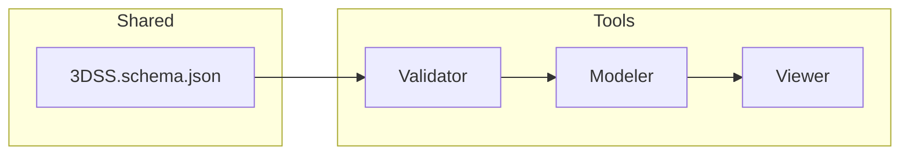

# 3DSL アーキテクチャ構造図
### Validator 節（P1-03 内部構造図 / locked）

---

```mermaid
flowchart TD

A0[開始 / Validator呼出] --> A1[入力判定モジュール]
A1 -->|A: JS Object| B1[validate()]
A1 -->|B: JSON文字列| B2[validateJSON()]
A1 -->|C: ファイル or Blob| B3[validateFile() / validateBlob()]

%%------------------------------------------------
subgraph Core[Core Pipeline]
  B1 & B2 & B3 --> C1[Parse → Load JSON]
  C1 --> C2[SchemaVersionCheck]
  C2 --> C3[AjvCompile(schema_uri)]
  C3 --> C4[AjvValidate(data)]
  C4 --> C5[InternalRulesCheck]
  C5 --> C6[AssembleResultObject]
end
%%------------------------------------------------

C6 --> D1[出力整形: ValidationResult(JSON)]
D1 --> D2[オプション分岐]
D2 -->|CLI| E1[printTextSummary()]
D2 -->|Library| E2[return result]
D2 -->|Web UI| E3[renderUI(result)]
E1 & E2 & E3 --> F1[終了]

%%-----------------------------------------------
subgraph InternalRules[内部検査群]
  IR1[ref_integrity()]:::sub
  IR2[tagPatternCheck()]:::sub
  IR3[metaRequiredCheck()]:::sub
  IR4[unknownPropsCheck()]:::sub
end
C5 -->|呼出| InternalRules
InternalRules --> C6

classDef sub fill:#f3f3f3,stroke:#555,stroke-width:1px;
```

---

## 機能レイヤ構造

| 層 | モジュール | 概要 |
|----|-------------|------|
| **Input Layer** | `validate() / validateJSON() / validateFile() / validateBlob()` | 呼び出し経路の統合。ファイル/文字列/オブジェクトを統一フォーマットへ変換。 |
| **Schema Layer** | `AjvCompile() / AjvValidate()` | `/schemas/3DSS.schema.json` をコンパイルし、draft2020-12 準拠で型検証。 |
| **Rule Layer** | `InternalRulesCheck()` | `$defs.validator` では定義できない独自整合（ref_integrity / tagPattern / metaRequired / unknownProps）。 |
| **Output Layer** | `AssembleResultObject()` | 検証結果を `ValidationResult` 構造にまとめ、CLI/UI/Library へ分配。 |

---

## データフロー概要

1. **入力判定**（Object / JSON / File）  
2. **スキーマ参照**（3DSS.schema.json, version=1.0.0）  
3. **Ajv検証**（型・列挙・必須項目）  
4. **内部ルール検証**（ref整合・tag形式・meta必須）  
5. **結果統合**（status / errors / warnings / meta_info）  
6. **出力**（CLI / API / Web UI 向け分岐）

---

## 内部関数依存関係（擬似コード）

```ts
function validate(data, opts) {
  const json = normalizeInput(data);
  const meta = extractMeta(json);
  ensureSchemaVersion(meta.schema_uri);
  const ajv = AjvCompile(meta.schema_uri);
  const base = ajv.validate(json);
  const ext = InternalRulesCheck(json);
  return AssembleResultObject(base, ext, meta);
}

function InternalRulesCheck(data) {
  return {
    ref: ref_integrity(data),
    tag: tagPatternCheck(data),
    meta: metaRequiredCheck(data),
    props: unknownPropsCheck(data)
  };
}
```

---

## 制約条件
- スキーマ固定：`/schemas/3DSS.schema.json` draft2020-12  
- Validatorバージョン：`1.0.0`  
- 入力サイズ上限：5MB  
- 外部依存：`ajv@^8`, `ajv-formats`  
- 出力構造：`ValidationResult`（P1-02 定義に準拠）

---

この図および構造は Validator の **P1-03（内部構造図 / locked）** として、次フェーズ P1-04（依存関係・命名規則定義）に継承する。


---

## Modeler 節（P1-03 内部構造図 / draft）

```mermaid
flowchart TD

A0[起動 / 新規ドキュメント生成] --> A1[Core.init()]
A1 --> A2[StateManager.initialize()]
A2 --> A3[UI.bindEvents()]
A3 --> A4[EventRouter]

subgraph CorePipeline[Modeler Core Pipeline]
  A4 --> B1[createPoint()]
  A4 --> B2[createLine()]
  A4 --> B3[createAux()]
  A4 --> B4[updateMeta()]
  A4 --> B5[deleteElement()]
  A4 --> B6[exportJSON()]
end

B6 --> C1[ExportPhase]
subgraph ExportPhase[Export共通契約]
  C1a[Resolve 拘束解消] --> C1b[Flatten 展開]
  C1b --> C1c[Prune 未確定除去]
  C1c --> C1d[Normalize 正規化]
  C1d --> C1e[Validate Schema検証]
  C1e --> C1f[Export JSON出力]
end

C1f --> D1[ファイル保存 / Viewer送信]

subgraph InternalModules[内部モジュール群]
  M1[StateManager]:::mod
  M2[UndoRedoManager]:::mod
  M3[ValidatorBridge]:::mod
  M4[Exporter]:::mod
  M5[UIController]:::mod
end

B1 & B2 & B3 & B4 & B5 & B6 --> M1
M1 --> M2
M2 --> M4
M4 --> M3

classDef mod fill:#f3f3f3,stroke:#555,stroke-width:1px;
```

---

### モジュールレイヤ構成

| 層 | 主モジュール | 概要 |
|----|---------------|------|
| **Input Layer** | `UIController`, `EventRouter` | クリック・ドラッグなどユーザインタラクションを受け取り、API呼出を発火。 |
| **Core Layer** | `ModelerAPI`（create／update／delete） | points・lines・aux・meta の生成・編集・削除。 |
| **State Layer** | `StateManager`, `UndoRedoManager` | 現在の構造状態を管理し、履歴を保持。 |
| **Validation Layer** | `ValidatorBridge` | 保存時に外部 Validator を呼び出し、結果を受け取る。 |
| **Export Layer** | `Exporter` | Resolve→Flatten→Prune→Normalize→Validate→Export を順次実行。 |
| **Output Layer** | ファイル／Viewer出力 | schema-valid JSON として保存または Viewer に送信。 |

---

### 処理フロー要約

1. **起動／新規ドキュメント作成**  
   - document_meta を自動生成（uuid, schema_uri, version, author）。  
2. **ユーザ操作受付**  
   - `UIController` がイベントを `EventRouter` に転送し、API 呼出。  
3. **要素操作**  
   - `createPoint` / `createLine` / `createAux` / `updateMeta` / `deleteElement`。  
   - 変更は `StateManager` が保持、`UndoRedoManager` に記録。  
4. **出力処理（ExportPhase）**  
   - **Resolve**：拘束・依存関係を数値化。  
   - **Flatten**：グループ構造を展開し単層化。  
   - **Prune**：一時オブジェクトや低信頼要素を削除。  
   - **Normalize**：単位・色・enumを正規化。  
   - **Validate**：ValidatorBridgeを通じて検証。  
   - **Export**：3DSS準拠JSONとして出力。  
5. **出力先**  
   - ローカル保存（.3dss.json）または Viewer への一時送信。  

---

### 内部依存関係（擬似コード）

```ts
class ModelerAPI {
  constructor(state) { this.state = state; }

  createPoint(pos, marker) {
    const p = { appearance:{ position:pos, marker }, meta:{ uuid:genUUID() } };
    this.state.points.push(p);
    this.history.record('createPoint', p);
  }

  createLine(a_uuid, b_uuid, relation) {
    const l = { signification:{ relation }, appearance:{ end_a:{ref:a_uuid}, end_b:{ref:b_uuid} }, meta:{uuid:genUUID()} };
    this.state.lines.push(l);
  }

  exportJSON() {
    const data = this.state.toJSON();
    const resolved = Exporter.run(data);
    ValidatorBridge.validate(resolved);
    saveFile(resolved, 'scene.3dss.json');
  }
}
```

---

### データ保持構造

```js
{
  points: [Point],
  lines: [Line],
  aux: [Aux],
  document_meta: { uuid, schema_uri, author, version },
  history: [UndoRedoRecord],
  validator: { status, errors[], warnings[] }
}
```

---

### 制約・備考
- Schema固定：`/schemas/3DSS.schema.json` draft 2020-12  
- 外部依存：`three.js`, `ajv`, `ajv-formats`  
- Undo/Redo：最大64段階（StateManager上限）  
- 出力：常に Validator 検証を通過した JSON のみ  
- Viewer通信：構造状態を `postMessage` / `sharedState` 経由で渡す  

---

この節は Modeler の **P1-03（内部構造図 / draft）** として、今後の P1-04（依存関係・命名規則定義）に継承する。

---

## Viewer 節（P1-03 内部構造図 / draft）

```mermaid
flowchart TD

A0[開始 / JSON読込] --> A1[Viewer.init()]
A1 --> A2[ValidatorBridge.checkSchema()]
A2 --> A3[SceneBuilder.buildScene()]
A3 --> A4[RenderEngine.render()]
A4 --> A5[UIController.init()]

subgraph SceneBuilder[SceneBuilder Modules]
  SB1[parsePoints()] --> SB2[parseLines()]
  SB2 --> SB3[parseAux()]
  SB3 --> SB4[composeMetaOverlay()]
end
A3 --> SceneBuilder
SceneBuilder --> A4

subgraph RenderEngine[RenderEngine Modules]
  R1[setupRenderer()] --> R2[setupCamera()]
  R2 --> R3[setupControls()]
  R3 --> R4[setupLights()]
  R4 --> R5[drawObjects()]
end
A4 --> RenderEngine
RenderEngine --> A5

subgraph UIController[UI Modules]
  U1[CheckboxPanel]:::sub
  U2[CameraPanel]:::sub
  U3[HighlightPanel]:::sub
  U4[OverlayRenderer]:::sub
end
A5 --> UIController

U1 & U2 & U3 & U4 --> V1[updateViewState()]
V1 --> V2[exportViewState()]
V2 --> F1[終了 / view_state 出力]

classDef sub fill:#f3f3f3,stroke:#555,stroke-width:1px;
```

---

### 機能レイヤ構造

| 層 | 主モジュール | 概要 |
|----|---------------|------|
| **Input Layer** | `Viewer.init()` / `ValidatorBridge.checkSchema()` | JSON 読込とスキーマ検証。 |
| **Scene Layer** | `SceneBuilder` | points / lines / aux を three.js Object3D に変換し、SceneGraph 構築。 |
| **Render Layer** | `RenderEngine` | Renderer, Camera, Controls, Lights の初期化と描画制御。 |
| **UI Layer** | `UIController` | 可視・不可視切替、カメラ操作、ハイライト設定、Overlay表示。 |
| **State Layer** | `ViewStateManager` | 可視要素・カメラ位置・選択情報を管理し export。 |
| **Output Layer** | `exportViewState()` | 現在状態を JSON として出力（Modeler・外部共有）。 |

---

### 処理フロー概要

1. **初期化**：`Viewer.init()` が 3DSS.json を読み込み、Validator で schema-version 一致を確認。  
2. **Scene構築**：points → lines → aux → meta の順で three.js オブジェクト化。  
3. **レンダリング**：`RenderEngine` により描画、OrbitControls でカメラ操作可能。  
4. **UI制御**：`CheckboxPanel` 等から可視項目を変更、`OverlayRenderer` が meta 情報を更新。  
5. **状態出力**：`exportViewState()` が現在のカメラ位置・表示状態を JSON にまとめ出力。  

---

### 内部依存関係（擬似コード）

```ts
class Viewer {
  async init(jsonPath) {
    const data = await loadJSON(jsonPath);
    ValidatorBridge.checkSchema(data);
    this.scene = SceneBuilder.buildScene(data);
    this.renderer = RenderEngine.setup(this.scene);
    this.ui = new UIController(this.scene, this.renderer);
  }
}

class SceneBuilder {
  static buildScene(data) {
    const scene = new THREE.Scene();
    parsePoints(data.points, scene);
    parseLines(data.lines, scene);
    parseAux(data.aux, scene);
    composeMetaOverlay(data.document_meta);
    return scene;
  }
}
```

---

### データ構造

```js
{
  scene: THREE.Scene,
  view_state: {
    visible: { points: true, lines: true, aux: false, document_meta: true },
    camera: { position: [2,3,6], target: [0,0,0] },
    highlight: [], selection: []
  },
  meta_info: {
    schema_version: "1.0.0",
    validated_by: "Validator v1.0.0"
  }
}
```

---

### 制約・備考
- Schema固定：`/schemas/3DSS.schema.json` draft2020-12  
- three.js r160 以降必須  
- OrbitControls・dat.GUI・ajv に依存  
- ViewState JSON サイズ上限：1MB  
- Validator検証済データのみ受理  
- UI操作は全てイベント駆動（チェックボックス更新時に render 再実行）  

---

この節は Viewer の **P1-03（内部構造図 / draft）** として、今後の P1-04（依存関係・命名規則定義）に継承する。


---
---


# P1-04 依存関係・命名規則定義（全ライン共通）

## 1. 依存関係一覧

| 区分 | 主要ライブラリ／モジュール | 使用箇所 | バージョン／備考 |
|------|-----------------------------|-----------|------------------|
| **Core Validation** | `ajv` | Validator / Modeler / Viewer | ^8.x（draft 2020-12対応） |
| **Format検証** | `ajv-formats` | Validator / Modeler | color, uuid, uri, email 等 |
| **3D描画** | `three.js` | Modeler / Viewer | r160以降（ESM import） |
| **操作補助** | `OrbitControls` | Viewer | three/examples/jsm/controls/OrbitControls.js |
| **UI構築** | `dat.GUI` | Viewer（UIPanel制御） | ^0.7.x |
| **履歴管理** | `UndoRedoManager`（自作） | Modeler | /code/common/state/UndoRedoManager.js |
| **エクスポート共通契約** | `Exporter`（自作） | Modeler | Resolve / Flatten / Prune / Normalize 実装 |
| **検証橋渡し** | `ValidatorBridge`（自作） | Modeler / Viewer | 内部的に `import('/code/validator/index.js')` |
| **状態保持** | `StateManager`（自作） | Modeler | points / lines / aux / meta 保持構造 |
| **UI操作層** | `UIController`（自作） | Modeler / Viewer | 各UIイベント → Core API 呼出 |
| **共通Schema参照** | `/schemas/3DSS.schema.json` | 全ライン | draft 2020-12固定、v1.0.0 |

---

## 2. 命名規則（共通）

| 分類 | 規則 | 例 |
|------|------|------|
| **コードファイル（HTML/JS/CSS）** | アンダースコア（`_`）禁止。camelCase または kebab-case 使用。 | `/code/modeler/mainView.js`, `/code/viewer/render-engine.js` |
| **ドキュメント／スキーマファイル（.md / .json）** | セクション識別のため `_` 許可。 | `/specs/3DSD_modeler.md`, `/schemas/3DSS.schema.json` |
| **クラス名** | PascalCase | `ModelerAPI`, `ValidatorBridge`, `ViewStateManager` |
| **関数名** | camelCase | `createPoint`, `validateFile`, `exportJSON` |
| **イベント名** | on＋動詞＋名詞 | `onSelectPoint`, `onValidateComplete` |
| **変数名** | snake_case は禁止、camelCase統一 | `viewState`, `schemaUri`, `metaInfo` |
| **UUID項目** | 末尾を明示：`*_uuid` | `document_uuid`, `group_uuid`, `meta.uuid` |
| **JSONキー** | 3DSS.schema.json に準拠、スキーマ外キーは禁止 | `points`, `lines`, `aux`, `document_meta` |
| **内部ファイル拡張子** | `.js`（ESM） / `.json` / `.md` / `.html` | - |
| **出力ファイル** | `.3dss.json`（schema-valid 構造ファイル）。アンダースコア禁止。 | `scene-001.3dss.json` |
| **命名語彙統一** | *modeler* / *viewer* / *validator* 固定（接頭に 3DSD- 不要） | `"generator": "3DSD-Modeler/1.0.0"` |

---

## 3. 依存方向ルール

```text
Validator ← Modeler ← Viewer
```

- Validator：下層基盤。どこからも呼ばれるが他を呼ばない。  
- Modeler：Validatorを利用するが、Viewerを呼ばない。  
- Viewer：Validatorを利用するが、Modelerを呼ばない。  
- 三者は `/schemas/3DSS.schema.json` を共通の基点とする。

---

## 4. バージョン連鎖ポリシー

| 要素 | 管理項目 | 継承規則 |
|------|-----------|-----------|
| `document_meta.schema_uri` | スキーマ定義URI | 3DSS.schema.jsonのversionに一致 |
| `document_meta.version` | 文書版 | Modeler → Viewerに継承 |
| `meta_info.validated_by` | 検証実行バージョン | Validatorのversionを明記 |
| `meta_info.generator` | 生成モジュール | `"3DSD-Modeler/x.x.x"` or `"3DSD-Viewer/x.x.x"` |

---

## 5. モジュール相互依存図（概念）



---

## 6. 命名衝突禁止リスト

| 禁止語 | 理由 |
|--------|------|
| `specsync`, `registry`, `plan` | 仮想中間層に該当（3DSLでは禁止） |
| `digidiorama`, `canvas` | 旧名称／誤参照を防ぐため |
| `root` | JSONスキーマ上の非構造参照誤解を防ぐため |
| `children` | 再帰構造誤導のため使用禁止（代替：`subpoints`） |

---

この節は **P1-04（依存関係・命名規則定義 / locked）** として、P2 フェーズへ継承する。

