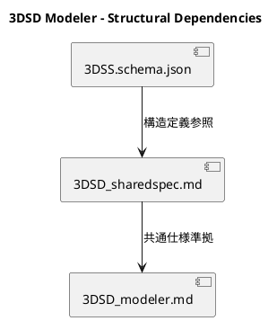
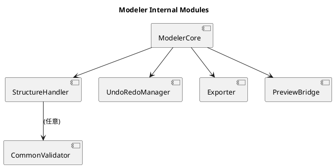
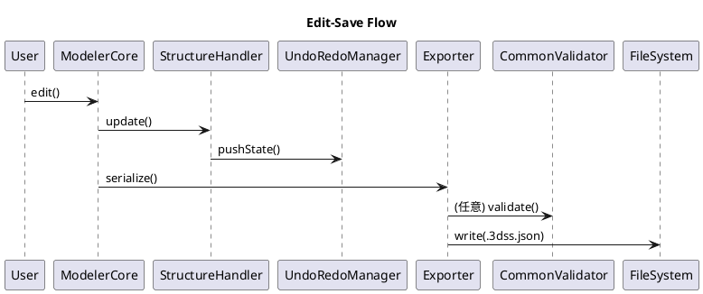
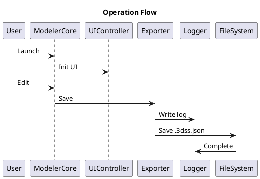

# 3DSD-Modeler

## 0. 概要（Overview）

3DSD-Modeler は、3DSL プロジェクトにおける構造生成・編集・保存の中核アプリケーションである。
本システムは /schemas/3DSS.schema.json に準拠し、構造要素を lines → points → aux → document_meta の順に管理・操作する。

Modeler は Viewer とは独立したアプリケーションであり、両者は共通仕様 `/specs/3DSD_sharedspec.md` に定義された共通実行基盤・命名規範・制約群に従う。
両アプリは同一スキーマ上で動作しつつも、目的・UI構造・出力形式は独立して設計される。

Codex は本仕様をもとに自動生成を行い、人間による設計判断と統合して3DSL 全体の仕様駆動開発サイクルを実現する。

📘 参照関係
| 種別    | ファイル                                             | 用途                      |
| ----- | ------------------------------------------------ | ----------------------- |
| 共通仕様  | `/specs/3DSD_sharedspec.md`                      | 命名規範・共通実行基盤・Directive体系 |
| スキーマ  | `/schemas/3DSS.schema.json`                      | 構造定義の基底                 |
| 実装出力  | `/code/modeler/`                                 | Codex出力ディレクトリ           |
| 実装プロト | `/proto/modeler.html`, `/proto/proto_modeler.js` | 試作・評価版                  |
| 運用規約  | `/specs/3DSL_仕様駆動開発プロセス.md`                      | 開発行動基準                  |

## 1. 依存構成（schema／sharedspec）
### 1.1 依存関係の原則
Modeler は以下の依存方向に基づいて構成される：
 `3DSS.schema.json` → sharedspec → Modeler

逆方向依存（Modeler → sharedspec や schema への直接干渉）は禁止される。
Codex による自動展開もこの依存方向を厳守する。

### 1.2 構造位置づけ（概念図）


### 1.3 役割と責務
| 項目    | Modeler の責務                                   | 非責務（他層へ委譲）     |
| ----- | --------------------------------------------- | -------------- |
| 構造生成  | `lines / points / aux / document_meta` の生成・接続 | 表示（Viewer）     |
| 構造編集  | プロパティ編集・UUID自動管理・Undo/Redo                    | 構造解析           |
| 整合検証  | 共通検証基盤（CommonValidator）による任意検証              | Validator実装自体  |
| 保存出力  | schema-valid JSON 出力                          | 履歴管理      |
| プレビュー | 内部プレビューウィンドウ                                  | Viewer機能ではない   |
| UI操作  | Lite / Edit / Expert / Dev モード切替              | Viewer UI設定    |
| ログ管理  | Logger出力                                | Analyzer領域 |

### 1.4 同期運用フェーズ
| 工程   | 主体         | 成果物                           | 備考                 |
| ---- | ---------- | ----------------------------- | ------------------ |
| 仕様化  | 人間＋ChatGPT | `/specs/3DSD_modeler.md`      | 設計定義               |
| 実装生成 | Codex      | `/code/modeler/`              | Directive 20〜27 準拠 |
| 検証   | 人間         | `/logs/runtime/modeler_*.log` | 実機検証               |
| 改訂   | 人間＋Codex   | `/meta/update_log.md`         | 差分管理               |

---

## 2. 共通実行基盤準拠（Shared Runtime Foundation）
Modeler は sharedspec §2 に定義された共通実行基盤を継承し、以下のモジュール・環境変数・構成規約を使用する。

### 2.1 共通ディレクトリ構造

/code/
 ├─ common/
 │   ├─ utils/
 │   │   ├─ logger.js
 │   │   └─ exception_handler.js
 │   ├─ ui/
 │   │   ├─ tokens.json
 │   │   ├─ components/
 │   │   └─ input_map.json
 │   ├─ geom/
 │   │   └─ math_utils.js
 │   ├─ constants/
 │   │   └─ paths.js
 │   └─ validator_core.js   (任意利用)
 ├─ modeler/
 │   ├─ core/
 │   ├─ ui/
 │   ├─ exporter/
 │   └─ test/
 └─ viewer/

 /data/
 /logs/runtime/
 /cache/

### 2.2 共通環境変数
| 変数名                    | 既定値              | 内容                               |
| ---------------------- | ---------------- | -------------------------------- |
| `MODE`                 | `"local"`        | 実行モード（`local` / `codex` / `web`） |
| `DATA_DIR`             | `/data/`         | 保存先ディレクトリ                        |
| `LOG_DIR`              | `/logs/runtime/` | 実行ログ保存先                          |
| `CACHE_DIR`            | `/cache/`        | 異常終了時キャッシュ保存                     |
| `HTTP_SERVER_REQUIRED` | `true`           | `file://` 起動を禁止                  |
| `SHAREDSPEC_VERSION`   | `"1.0.0"`        | 共通仕様の整合チェック                      |

### 2.3 共通モジュール参照
| モジュール            | 機能            | 必須性    | 実装位置                                      |
| ---------------- | ------------- | ------ | ----------------------------------------- |
| Logger           | イベント出力・診断ログ | Must   | `/code/common/utils/logger.js`            |
| ExceptionHandler | 例外捕捉・安全復帰     | Must   | `/code/common/utils/exception_handler.js` |
| Geom             | 幾何補助関数群       | Should | `/code/common/geom/math_utils.js`              |
| Paths            | 定数定義・共通パス管理   | Must   | `/code/common/constants/paths.js`         |
| CommonValidator  | スキーマ検証（任意呼出）  | May    | `/code/common/validator_core.js`          |

### 2.4 内部構造（Modeler Core Architecture）


概要:
Modeler は ModelerCore を中心に構成され、構造管理・編集履歴・出力処理・プレビュー制御を担当する。
CommonValidator は BUILD_MODE="codex" 時のみ自動接続され、手動実行時はスキップされる。

### 2.5 内部コンポーネント概要
| モジュール | 関数 | 引数 | 戻り値 | 概要 |
|-------------|------|------|--------|------|
| ModelerCore | `loadDocument(filePath)` | `string` | `object` | JSONをロードして構造を初期化 |
| StructureHandler | `addLine(lineObj)` | `object` | `boolean` | 構造にラインを追加し整合チェック |
| UndoRedoManager | `pushState()`, `undo()`, `redo()` | `object` | `string` | 編集履歴管理 |
| Exporter | `export3DSS(data)` | `object` | `string` | ファイルパスを返却 |
| PreviewBridge | `updatePreview()`, `syncCamera()` | `object` | `object` | 内部プレビュー更新 |

### 2.6 共通UI規範
UI モード（Lite / Edit / Expert / Dev）は sharedspec §4.4 に準拠し、Codex 展開時には ui_mode.js 内で環境変数 UI_MODE により制御される。

---

## 3. 命名規範および Directive 構文
命名規範および Directive 構文は sharedspec §3 に完全準拠する。
Modeler 独自要素（内部関数・UIイベント等）もこれに従う。

| 対象     | 規則                 | 例                                     |
| ------ | ------------------ | ------------------------------------- |
| 変数・関数  | camelCase          | `createLine()`, `exportModel()`       |
| クラス・型  | PascalCase         | `ModelerCore`, `Exporter`             |
| ファイル   | snake_case         | `modeler_core.js`, `ui_controller.js` |
| ディレクトリ | lowerCamel         | `core`, `ui`, `exporter`              |
| イベント定数 | UPPER_CASE + snake | `EVENT_EXPORT_DONE`                   |

Directive 記述は Markdown 表形式を用い、Codex は “項目 / 内容” ペアを静的解析して展開を行う。

---

## 4. Modeler 固有仕様（詳細）
### 4.1 UI モード仕様
| モード    | 主対象ユーザ | 機能概要                 |
| ------ | ------ | -------------------- |
| Lite   | 一般閲覧   | 構造選択・基本属性閲覧のみ        |
| Edit   | 編集者    | ポイント／ライン編集・Undo/Redo |
| Expert | 技術者    | 補助要素(aux)操作・メタデータ管理  |
| Dev    | 開発者    | 内部構造表示・Codex連携ログ出力   |

UI は `/code/common/ui/components/` 配下で共通定義され、モード切替は UIController （Dir 22） が管理する。

#### 4.1.1 UIコンポーネント対応表
| コンポーネントID | 機能 | 使用モード | 対応イベント |
|------------------|------|-------------|--------------|
| `panelStructure` | 構造ツリー表示 | Edit/Expert | `EVT_MODEL_SELECT` |
| `panelMeta` | メタ情報編集 | Expert | `EVT_META_UPDATE` |
| `previewPane` | 内部プレビュー | 全モード | `EVT_PREVIEW_REFRESH` |

### 4.2 Exporter 処理段階（旧仕様復元）
Modeler の出力は以下の5段階で実施される：

1. resolve – 参照関係を絶対化
2. flatten – 階層構造を平坦化
3. normalize – 命名・座標整形
4. validate – CommonValidator による検証（任意）
5. export – .3dss.json へ出力

各段階は Exporter モジュール（Dir 23） 内で個別関数として定義され、Codex 展開時に自動生成対象となる。

#### 4.2.1 出力フォーマット
```json
{
  "lines": [],
  "points": [],
  "aux": [],
  "document_meta": {}
}
```

### 4.3 Undo/Redo 仕様
UndoRedoManager は最大100履歴まで保持し、undo() 実行時には `/cache/last_edit.json` に退避する。
異常終了後、起動時に `/cache/last_edit.json` を検出した場合、再ロードを促すダイアログを自動表示する。

### 4.4 操作シーケンス（編集〜保存）


---

## 5. Codex 指令体系（Dir 20–27）
### 5.1 展開順序
| 優先 | 範囲                 | 内容                  |
| -- | ------------------ | ------------------- |
| ①  | sharedspec (01–13) | 共通基盤                |
| ②  | modeler (20–27)    | 構造生成・UI制御・Exporter  |
| ③  | codex内部 (90–99)    | SelfTest / Finalize |
重複時は上位優先（sharedspec）

### 5.2 Directive 一覧
| Dir | 名称                 | 概要                     | 出力先                                       |
|:---:| ------------------ | ---------------------- | ----------------------------------------- |
| 20  | Modeler Core       | Core 初期化               | `/code/modeler/core/modeler_core.js`      |
| 21  | Structure Handler  | lines/points/aux 編集API | `/code/modeler/core/structure_handler.js` |
| 22  | UI Controller      | UI 状態管理                | `/code/modeler/ui/ui_controller.js`       |
| 23  | Exporter           | 出力・整合チェック              | `/code/modeler/exporter/exporter.js`      |
| 24  | Undo/Redo Manager  | 編集履歴管理                 | `/code/modeler/core/history_manager.js`   |
| 25  | LocalCache Manager | キャッシュ保存                | `/code/modeler/core/cache_manager.js`     |
| 26  | Preview Bridge     | 内部プレビュー描画              | `/code/modeler/ui/preview_bridge.js`      |
| 27  | SelfTest_M         | 自己検証                   | `/code/modeler/test/selftest_m.js`        |

---

## 6. 運用および更新ルール
### 6.1 標準運用フロー（旧仕様復元）



### 6.2 更新手順
1. 編集：対象（`schema/sharedspec/modeler`）を修正
2. 差分記録：`/meta/update_log.md` に追記
3. Codex出力：該当Directive再実行
4. 検証：サンプル .3dss.json で整合確認
5. コミット：仕様→コード→サンプル→ログ順

### 6.3 例外処理・復旧
- 保存失敗時：`E_SAVE_FAIL` を出力し、`/cache/last_edit.json` に退避
- JSON構文エラー：`E_PARSE_FAIL` を返却
- Draft不一致(schema $id mismatch)：`E_DRAFT_UNSUPPORTED` を返却

### 6.4 禁止事項
- sharedspec への逆依存
- 自動 UML 生成
- `/code/common/` 外への共通実装配置
- `file://` 起動
- `$defs` 直接編集

---
_End of Specification — 3DSD_modeler.md (v1.0.0 / Dir20–27 / Sharedspec v1.0.0 整合)_
