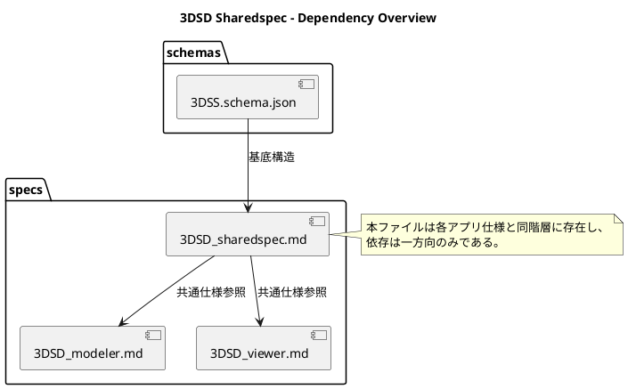
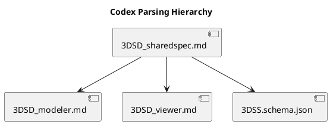

# 3DSD Sharedspec
#### ― 共通基盤およびCodex指令体系仕様書 ―

## 0. 概要（Overview）

3DSD_sharedspec.md は、3DSL系列アプリケーション（Modeler・Viewer など）間で共通して使用される構造・環境・命名・制約・Directive 規範を定義する共通基盤仕様書である。
本書は思想や上位設計方針を規定するものではなく、各アプリ仕様間で偶発的に一致した仕様・構造・制約をCodex が安定的に再展開できる形で共通明文化することを目的とする。
- 本書は各アプリの実装やUI構造には介入しない。
- Modeler／Viewer はそれぞれ独立アプリケーションであり、sharedspec は両者を拘束するものではなく、整合参照のための補助定義書である。
- Codex は本書を上位仕様として解釈せず、参照整合と共通出力の基盤として扱う。

### 0.1 文書構成
| 節      | 内容                     |
| ------ | ---------------------- |
| **§1** | 依存構成と参照関係              |
| **§2** | 共通実行基盤定義               |
| **§3** | 命名規則および Directive 構文規範 |
| **§4** | 共通制約（Constraints）    |
| **§5** | Codex 展開規約および整合処理      |
| **§6** | 運用および更新ルール             |

## 1. 依存構成と参照関係
### 1.1 依存関係の原則
- sharedspec は /schemas/3DSS.schema.json に基づき、スキーマ定義に対して共通環境・命名・指令体系・制約仕様を提供する。
- Modeler・Viewer はそれぞれ/specs/3DSD_modeler.md、/specs/3DSD_viewer.md を基点とし、必要に応じて sharedspec を参照する。
- 依存方向は一方向であり、次のように固定する：

```
schema → sharedspec → 各アプリ仕様
```
 逆依存（アプリ仕様から sharedspec を上書きすること）は禁止とする。
- /code/common/ 以下の実装は sharedspec に基づき Codex によって再構成されるが、sharedspec 自体はコード生成を直接行わない。

### 1.2 参照構造図（概要）



### 1.3 関連文書一覧
| 区分            | ファイル                        | 内容                  |
| ------------- | --------------------------- | ------------------- |
| **スキーマ定義**    | `/schemas/3DSS.schema.json` | データ構造の基底規範          |
| **共通仕様**      | `/specs/3DSD_sharedspec.md` | 共通定義・命名・Directive体系 |
| **Modeler仕様** | `/specs/3DSD_modeler.md`    | 構造生成・編集仕様           |
| **Viewer仕様**  | `/specs/3DSD_viewer.md`     | 可視化・表示仕様            |
| **Codex設定**   | `/specs/3DSD_codex.md`      | Directive展開基準       |

## 2. 共通実行基盤定義（Common Runtime Base）
### 2.1 共通ディレクトリ構造

```
/code/
├─ common/
│ ├─ utils/
│ │ ├─ logger.js
│ │ └─ exception_handler.js
│ ├─ ui/
│ │ ├─ tokens.json
│ │ ├─ components/
│ │ └─ input_map.json
│ ├─ geom/
│ │ └─ math_utils.js
│ └─ constants/
│   └─ paths.js
├─ modeler/
└─ viewer/

/data/
/logs/runtime/
/cache/
```

- /code/common/ は共通基盤モジュール格納領域であり、Modeler／Viewer 共通の UI／ロガー／例外処理等を配置する。
- /data/ は入出力データのルートディレクトリであり、サブ階層を持たない。
- /logs/runtime/ は実行・Codex生成・UI動作ログを保存する標準パス。
- /cache/ は異常終了時の自動退避領域である。

### 2.2 共通環境変数
| 変数名         | 既定値              | 用途                          |
| ----------- | ---------------- | --------------------------- |
| `MODE`      | `"local"`        | 実行モード：`local`／`codex`／`web` |
| `DATA_DIR`  | `/data/`         | データ入出力ディレクトリ                |
| `LOG_DIR`   | `/logs/runtime/` | ログ出力ディレクトリ                  |
| `CACHE_DIR` | `/cache/`        | 一時退避・自動保存ディレクトリ             |
| `UI_THEME`  | `"dark"`         | 共通UIテーマ（固定）                 |

### 2.3 共通UI・入力・ロガー基盤
| 項目           | ファイル                                      | 概要                                  |
| ------------ | ----------------------------------------- | ----------------------------------- |
| **UIトークン**   | `/code/common/ui/tokens.json`             | 色・余白・角丸・タイポグラフィなどの共通定義              |
| **UIプリミティブ** | `/code/common/ui/components/`             | Button／Panel／Dialogなどの基本構成          |
| **入力マップ**    | `/code/common/ui/input_map.json`          | キー／マウス／タッチ操作の共通マッピング                |
| **ロガー**      | `/code/common/utils/logger.js`            | 出力形式は [YYYY-MM-DD HH:MM:SS] [module] EVENT:<name> STATUS:<OK/WARN/ERROR> に完全一致する。|
| **例外ハンドラ**   | `/code/common/utils/exception_handler.js` | 共通例外捕捉・ユーザ通知変換                      |

### 2.4 共通モジュール共用範囲
| 区分                | 対象                               | 共用範囲 | 指令番号              |
| ----------------- | -------------------------------- | ---- | ----------------- |
| **必須共用 (Must)**   | UIトークン・UIプリミティブ・入力マップ・ロガー・例外ハンドラ | 完全共通 | Dir 02, 03, 06-08 |
| **推奨共用 (Should)** | 幾何／数学ユーティリティ・SchemaAdapter       | 技術共通 | Dir 04, 10        |
| **任意共用 (May)**    | カメラプリセット・テーマCSS・i18n             | 実装選択 | Dir 11–13         |

### 2.5 共用レベルの解釈とビルド挙動（決定規則）

- **共用レベルの意味**
  - **Must**: 既定で必ず組み込む（常時有効）
  - **Should**: 既定で組み込むが、明示的に除外指定された場合は外す
  - **May**: 既定では組み込まない。明示的に指定された場合のみ組み込む

- **Codex ビルドモード**
  - `BUILD_MODE=default`: Must + Should を生成、May は除外
  - `BUILD_MODE=strict`: Must のみ生成（Should/May は除外）
  - `BUILD_MODE=full`: Must + Should + May をすべて生成

- **指令ごとの上書き**
  - 各 Directive の「備考」に `INCLUDE=force` を記すと、ビルドモードに関わらずその指令を生成対象に含める
  - `INCLUDE=off` を記すと、ビルドモードに関わらず除外する

- **矛盾解決の優先度**
  1. `INCLUDE=force / off`（指令ローカル指定）
  2. `BUILD_MODE`（グローバル）
  3. 共用レベル（Must/Should/May）

補足：May 指令は Codex 評価結果や人間判断に基づく選択を要求せず、明示指定 (`INCLUDE=force`) の有無のみで実行可否を決定する。

---

## 3. 命名規則および Directive 構文規範（Naming Rules and Directive Syntax）
### 3.1 命名規則（Naming Rules）
| 対象            | 規則                                         | 例                                          |
| ------------- | ------------------------------------------ | ------------------------------------------ |
| **変数・関数名**    | camelCase                                  | `createPoint()`, `validateDocument()`      |
| **クラス名・型名**   | PascalCase                                 | `BridgeAdapter`, `SchemaRegistry`        |
| **ファイル名**     | snake_case（拡張子を除く）                         | `bridge_adapter.js`, `exporter.js`       |
| **ディレクトリ名**   | lowerCamel または明示英語語彙                       | `core`, `bridge`, `utils`                  |
| **UUIDフィールド** | `meta.uuid`, `document_meta.document_uuid` | –                                          |
| **ログタグ**      | `[module_name]` 固定                         | `[modeler]`, `[viewer]`                 |
| **イベント識別子**   | UPPER_CASE + snake                         | `EVENT_PROCESS_OK`, `EVENT_EXPORT_DONE` |

追加規定：
- 数値を含む識別子は禁止（例: line1, point2）。
- 名前空間衝突を避けるため、同一名関数の多重定義は行わない。
- モジュール跨ぎの依存関数は Bridge 経由で呼び出す。

### 3.2 Codex Directive 構文（Directive Syntax）
Codex Directive は、各アプリケーションのコード生成指令を共通テンプレート化するための構文規約である。
Modeler・Viewer・Sharedspec 各仕様で一貫して使用される。

#### 3.2.1 記述形式
Directive は Markdown のコードブロック内に次の構文で定義する：

 ### Dir <番号> - <名称>
 | 項目 | 内容 |
 |------|------|
 | **目的** | <Codexが行う処理の目的> |
 | **出力** | <生成先ディレクトリ> |
 | **生成モジュール** | <出力されるファイル名またはクラス名> |
 | **依存** | <必要なライブラリ・モジュール> |
 | **備考** | <特殊条件や注記> |

Codex はこの表形式を解析し、出力場所 → 生成モジュール → 依存 の順に展開を行う。
記述が欠落している場合、該当モジュールはスキップされる。

#### 3.2.2 Directive 番号規約
Directive 番号は 01 から 99 までの整数で、共通仕様（sharedspec）・各アプリ仕様間で一意である。
| 範囲    | 対象         | 内容例                            |
| ----- | ---------- | ------------------------------ |
| 01–19 | sharedspec | Validator, Logger, 共通定義群       |
| 20–39 | modeler    | UIController, Exporter, Core構成 |
| 40–59 | viewer     | RenderEngine, SceneController  |
| 90–99 | Codex内部指令| SelfTest, SchemaSync           |

#### 3.2.3 共通Directive定義（sharedspec）
##### Dir 01 - Validator Core 実装
 目的: Ajv + SchemaRegistry 初期化。
 出力: /code/common/validator_core.js
 依存: Ajv

##### Dir 02 - Logger 共通モジュール
 目的: 共通ログフォーマットで実行イベントを記録する。
 出力: /code/common/utils/logger.js
 依存: なし

##### Dir 03 - Exception Handler
 目的: 例外を捕捉し、ユーザ通知用メッセージに変換する。
 出力: /code/common/utils/exception_handler.js
 依存: なし

##### Dir 04 - Schema Adapter
 目的: `$defs` 展開・スキーマ整合性抽出。
 出力: /code/common/schema_adapter.js
 依存: なし

##### Dir 05 - ValidationResult クラス
 目的: 検証結果の共通フォーマット定義。
 出力: /code/common/validation_result.js
 依存: なし

##### Dir 06 - UI Tokens
 目的: UIトークン（色・余白等）を一元定義する。
 出力: /code/common/ui/tokens.(ts|js|json)
 依存: なし

##### Dir 07 - UI Primitives
 目的: 共通UIプリミティブを提供する。
 出力: /code/common/ui/components/* (Button/Toolbar/Dialog など)
 依存: tokens

##### Dir 08 - Input Map
 目的: キー/ポインタの入力マップを共通化する。
 出力: /code/common/ui/input_map.json（キー/マウス/ジェスチャ定義）
 依存: なし

##### Dir 09 - Env & Paths
 目的: 共通パス/環境定数を公開する。
 出力: /code/common/constants/paths.js（DATA_DIR 等）
 依存: なし

##### Dir 10 - Math & Geometry Utils（Should）
 目的: ベクトル/行列/角度/単位変換などの共通数理処理を提供する。
 出力: /code/common/geom/math_utils.js
 依存: なし

##### Dir 11 - Camera Presets（May）
 目的: カメラ距離・感度・軌道のプリセットを共通化する。

##### Dir 12 - Theme Styles（May）
 目的: ダークテーマのスタイル定数・変数を共通化する。

##### Dir 13 - i18n Base（May）
 目的: 共通UI文言を辞書化し、表記揺れを抑制する。

#### 3.2.4 Directive 構文の解釈ルール
Codex は Directive を構文解析する際、以下のルールを適用する：
| ルールID | 内容 |
|---------|------|
| **R1** | Directive 定義は **「\| 項目 \| 内容 \|」** のテーブル構造を必須とする。項目の順序は任意。 |
| **R2** | `目的` が欠落している場合は警告出力を行う。                           |
| **R3** | `出力場所` に指定されたディレクトリが存在しない場合、自動生成する。       |
| **R4** | `依存` フィールドに記載されたモジュールは import 文に自動展開される。      |
| **R5** | `備考` はコメント化され、出力コード内に `// NOTE:` として挿入される。      |
| **R6** | 既出 Directive 番号との重複は禁止。最初の定義のみ有効。                |

#### 3.2.5 Codex 展開例（参考）
 ##### Directive 01 - Validator Core 実装
 | 項目 | 内容 |
 |------|------|
 | **目的** | Ajv を初期化し、3DSS スキーマを登録する。 |
 | **出力場所** | `/code/common/validator_core.js` |
 | **生成モジュール** | `ValidatorCore` |
 | **依存** | ajv, ajv-formats |
 | **備考** | draft2020-12 を基底として meta_core → meta_meta の順に登録。 |

Codex 実行時に以下のように展開される：
 // auto-generated by Codex Directive 01
 import Ajv from "ajv";
 import addFormats from "ajv-formats";
 import schema from "../../schemas/3DSS.schema.json";
 
 export class ValidatorCore {
   constructor() {
     this.ajv = new Ajv({ strict: true });
     addFormats(this.ajv);
     this.ajv.addSchema(schema);
   }
   validate(data) {
     return this.ajv.validate(schema.$id, data);
   }
 }

### 3.2.6 Directive 構文の保守方針
- Directive の定義変更は /specs/3DSD_sharedspec.md 内でのみ行う。
- 各アプリ仕様（Modeler／Viewer）は参照・追加のみ可能。
- Codex による出力コード差分は /logs/runtime/codex_directive_diff.log に保存する。
- Directive 群は 3DSL 全体のコーディングパターンを標準化する唯一の仕様要素である。

---

## 4. 共通制約（Constraints）
### 4.1 実行環境制約
| 項目           | 内容                                              |
| ------------ | ----------------------------------------------- |
| **ブラウザ要件**   | Chrome／Edge／Firefox 最新2バージョン以内                  |
| **実行方式**     | HTTP経由（例：`http://localhost:8000/`）。`file://`は禁止 |
| **通信構成**     | ローカル完結。外部APIアクセス禁止                              |
| **スキーマ位置**   | `/schemas/3DSS.schema.json` に固定                 |
| **ファイル保存先**  | `/data/` 直下。サブディレクトリ禁止                          |
| **ログ保存先**    | `/logs/runtime/` に統一                            |
| **キャッシュ保存先** | `/cache/` 配下。異常終了時に自動退避                         |
| **UIテーマ**    | ダーク基調固定。CSSカスタム禁止                               |

### 4.2 データ構造制約
| 要素            | 制約                                 | 備考                                         |
|-----------------|--------------------------------------|----------------------------------------------|
| lines           | minItems: 0 / maxItems: 2048         | 各要素に `meta.uuid` 必須、`end_a` または `end_b` のいずれか必須 |
| points          | minItems: 0 / maxItems: 1024         | 各要素に `meta.uuid` 必須                     |
| aux             | minItems: 0 / maxItems: 128          | type: `grid`／`axis`／`shell`／`hud` のみ許可 |
| document_meta   | 固定1件                               | スキーマ `$id` と一致必須                     |

### 4.3 ファイル・ログ制約
| 項目           | 内容                                                      |
| ------------ | ------------------------------------------------------- |
| **出力拡張子**    | `.3dss.json` 固定                                         |
| **ログフォーマット** | `[YYYY-MM-DD HH:MM:SS] [module] EVENT:<name> STATUS:<OK/WARN/ERROR>` |
| **ログ上限**     | 各ファイル256行。超過時は古い行を削除                                    |
| **例外ログ**     | `/logs/runtime/*_error.log` に自動記録                       |

#### 4.4 UI操作制約（共通）
| 項目        | 内容                                   |
| --------- | ------------------------------------ |
| **キー操作**  | Shift：範囲選択／Ctrl(Cmd)：追加選択／Alt：スナップ解除 |
| **マウス操作** | 左：選択／右：メニュー／ホイール：ズーム                 |
| **タッチ操作** | ピンチ：ズーム／ドラッグ：回転                      |
| **ビュー切替** | Lite／Edit／Expert／Dev の4段階固定          |

---

## 5. Codex 展開規約および整合処理
### 5.1 Codex 読解階層



| 階層  | 内容                                                | Codex処理                 |
| --- | ------------------------------------------------- | ----------------------- |
| 第1層 | `/specs/3DSD_sharedspec.md`                       | 共通Directive群・制約・命名規則を読込 |
| 第2層 | `/specs/3DSD_modeler.md`, `/specs/3DSD_viewer.md` | 各アプリ固有Directive展開       |
| 第3層 | `/schemas/3DSS.schema.json`                       | スキーマ解析                  |
| 第4層 | `/code/`                                          | 出力コード生成                 |

### 5.2 展開順序（Directive Execution Order）
| 優先順位 | 範囲         | 番号範囲  | 内容                                     |
| ---- | ---------- | ----- | -------------------------------------- |
| ①    | sharedspec | 01–19 | Validator（任意）・Logger・UI・Exception等共通基盤 |
| ②    | modeler    | 20–39 | 編集系構成                                  |
| ③    | viewer     | 40–59 | 表示系構成                                  |
| ④    | codex内部    | 90–99 | SelfTest・DiffCheck                     |

### 5.3 整合チェック（Validator依存削除版）
| チェックID | 内容                                          | 結果処理                            |
| ------ | ------------------------------------------- | ------------------------------- |
| **V1** | sharedspecとmodeler／viewerのDirective番号重複確認   | 重複あり→上位優先・警告出力                  |
| **V2** | スキーマ `$id` と document_meta.schema_uri の一致確認 | 不一致→`E_SCHEMA_MISMATCH`         |
| **V3** | 生成ファイル数とDirective定義数の一致                     | 不一致→`E_MISSING_MODULE`          |
| **V4** | logger.jsの出力形式統一確認                          | 不一致→`E_LOG_FORMAT_INCONSISTENT` |

### 5.4 SelfTestモード仕様
Codexは MODE="codex" の際、自動的に以下を実行する：
 1. /schemas/3DSS.schema.json の構文確認
 2. Directive 01–19 の生成確認（共通モジュール）
 3. Directive 20–59 の展開検証（modeler／viewer）
 4. /data/sample/*.3dss.json の構文確認（全ファイルを対象）
 5. 出力コード依存解決チェック
 6. 結果ログ出力 (codex_selftest.log)

## 6. 運用および更新ルール
### 6.1 管理対象
| 区分      | パス                                                | 役割                   |
| ------- | ------------------------------------------------- | -------------------- |
| スキーマ    | `/schemas/3DSS.schema.json`                       | 構造の基底規範              |
| 共通仕様    | `/specs/3DSD_sharedspec.md`                       | 命名・制約・Directive体系    |
| アプリ仕様   | `/specs/3DSD_modeler.md`, `/specs/3DSD_viewer.md` | 各アプリ固有仕様             |
| 共通実装出力  | `/code/common/`                                   | sharedspec由来の共通モジュール |
| アプリ実装出力 | `/code/modeler/`, `/code/viewer/`                 | 各アプリの実装出力            |
| サンプル    | `/data/sample/*.3dss.json`                        | 検証用データ               |
| ログ      | `/logs/runtime/`                                  | 実行・生成・UI動作ログ         |
| 変更記録    | `/meta/update_log.md`                             | 更新履歴台帳               |

### 6.2 更新権限
| 操作           | 権限    | 備考                        |
| ------------ | ----- | ------------------------- |
| スキーマ編集       | 人間    | 変更時は sharedspec とサンプルを再検証 |
| sharedspec編集 | 人間    | §1〜§5 の範囲内のみ内容変更可（§6 への追記は運用記録目的のみ許可） |
| アプリ仕様編集      | 人間    | sharedspec 参照、矛盾は差分提案     |
| 実装生成         | Codex | Directive に従い出力           |
| 自動UML生成      | 不可    | 本リポジトリでは行わない              |

### 6.3 更新手順（標準フロー）
 1. 編集（schema／sharedspec／app-spec）
 2. 差分記録（/meta/update_log.md に追記）
 3. Codex出力（必要範囲のDirective再実行）
 4. 検証（サンプル .3dss.json を読み込み動作確認）
 5. ログ確認（codex_build.log）
 6. コミット：仕様→コード→サンプル→ログの順

### 6.4 ログ運用
| ファイル                            | 内容            | 上限      |
| ------------------------------- | ------------- | ------- |
| `/logs/runtime/logger.log`      | 実行イベント        | 256行ローテ |
| `/logs/runtime/codex_build.log` | Directive展開結果 | 256行ローテ |
| `/logs/runtime/*_error.log`     | 例外記録          | 256行ローテ |

### 6.5 禁止事項
- sharedspec を上位仕様として解釈する表現の追加
- /code/common/ 以外への共通実装配置
- file:// 起動
- $defs の直接編集
- Codex指令構文の改変（定義表以外での独自Directive追加）
