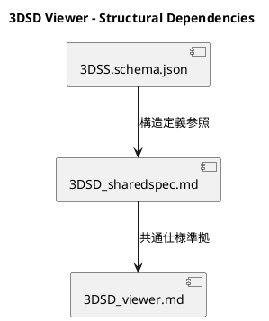
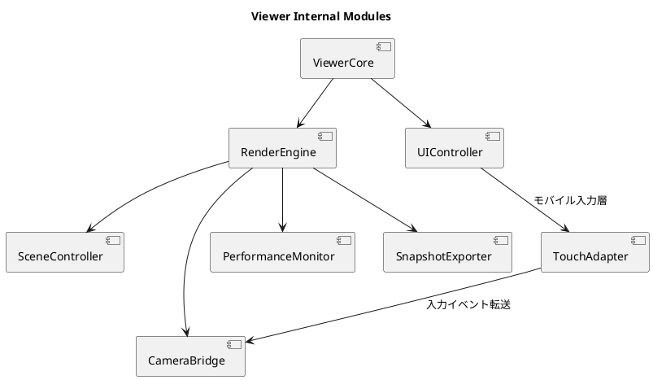
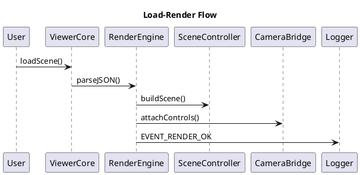
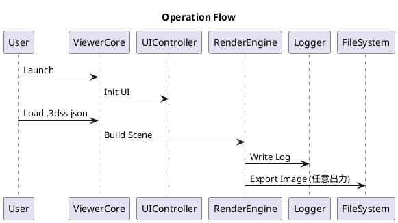

# 3DSD-Viewer

---

## 0. 概要（Overview）

3DSD-Viewer は、3DSL プロジェクトにおける構造データの三次元表示および閲覧・観察を担う独立アプリケーションである。
本システムは `/schemas/3DSS.schema.json` に準拠し、構造要素を lines → points → aux → document_meta の順に解析・描画する。
Viewer は Modeler と同一スキーマ・共通実行基盤を共有しながらも、編集機能を持たず可視化に特化した設計である。
Viewer は一般ユーザの閲覧・確認を主目的とし、PC・タブレット・スマートフォンの各デバイス上で統一した表示体験を提供する。
表示は自動スケーリングおよびカラープロファイル切替（ライト／ダークモード）に対応する。
両者は `/specs/3DSD_sharedspec.md` に定義された 共通仕様・命名規範・制約群 に従うが、アプリ間に直接的な依存は存在しない。

Codex は本仕様を基に Viewer コードを自動生成し、Three.js ベースの 3D 描画環境を構築する。

## 1. 依存構成（schema／sharedspec）
### 1.1 依存関係の原則
依存方向は次の一方向に限定される：
`3DSS.schema.json → sharedspec → viewer`
Viewer から sharedspec・schema への逆参照は禁止される。

### 1.2 構造位置づけ



### 1.3 役割定義と責務範囲
| 項目        | Viewer の責務               | 非責務（他層委任）      |
| --------- | ------------------------ | -------------- |
| **データ入力** | `.3dss.json` 読込と構造解析     | データ生成（Modeler） |
| **整合検証**  | CommonValidator による任意検証  | Validator 実装本体 |
| **シーン構築** | Three.js による描画要素構築       | 構造編集           |
| **カメラ制御** | OrbitControls ベースの視点操作   | 入力管理           |
| **UI切替**  | Lite/Edit/Expert/Dev モード | Modeler 設定管理   |
| **ログ管理**  | Logger による描画・FPS出力       | 集約解析（Analyzer） |

---

## 2. 共通実行基盤準拠 ＋ Viewer 内部構造
### 2.1 共通ディレクトリ構造（sharedspec §2.1 準拠）
```
/code/
 ├─ common/
 │   ├─ utils/
 │   │   ├─ logger.js
 │   │   └─ exception_handler.js
 │   ├─ ui/
 │   │   ├─ tokens.json
 │   │   ├─ components/
 │   │   └─ input_map.json
 │   ├─ geom/
 │   │   └─ math_utils.js
 │   ├─ constants/
 │   │   └─ paths.js
 │   └─ validator_core.js  # optional, used only when validation enabled
 ├─ modeler/
 ├─ viewer/
 │   ├─ core/
 │   ├─ ui/
 │   ├─ exporter/
 │   └─ test/
 /data/
 /logs/runtime/
 /cache/
```

### 2.2 共通環境変数
| 変数名              | 既定値                              | 用途          |
| ---------------- | -------------------------------- | ----------- |
| `MODE`           | `"local"`                        | 実行モード選択     |
| `DATA_DIR`       | `/data/`                         | 入出力ディレクトリ   |
| `LOG_DIR`        | `/logs/runtime/`                 | ログ保存パス      |
| `CACHE_DIR`      | `/cache/`                        | 異常終了時の一時退避先 |
| `VALIDATOR_PATH` | `/code/common/validator_core.js` | 検証モジュール参照先  |

### 2.3 共通モジュール参照
| モジュール            | 機能          | 必須性    | 実装位置                                      |
| ---------------- | ----------- | ------ | ----------------------------------------- |
| Logger           | イベント出力・描画ログ | Must   | `/code/common/utils/logger.js`            |
| ExceptionHandler | 例外捕捉・安全復帰   | Must   | `/code/common/utils/exception_handler.js` |
| Geom             | 幾何補助関数群     | Should | `/code/common/geom/math_utils.js`         |
| Paths            | 定数定義・共通パス管理 | Must   | `/code/common/constants/paths.js`         |
| CommonValidator  | スキーマ検証（任意）  | May    | `/code/common/validator_core.js`          |

### 2.4 内部構造（Viewer Core Architecture）


TouchAdapter はタッチ操作・スワイプ・ピンチズームを捕捉し、CameraBridge に入力イベントを中継する。

### 2.5 内部コンポーネント概要
| モジュール              | 主関数                                                  | 概要            |
| ------------------ | ---------------------------------------------------- | ------------- |
| ViewerCore         | `init()`, `loadScene()`, `updateScene()`             | アプリ基幹制御       |
| RenderEngine       | `buildScene()`, `renderFrame()`, `resize()`          | Three.js描画処理  |
| SceneController    | `parseJSON()`, `applyMaterial()`, `updateGeometry()` | データ構造からMesh生成 |
| CameraBridge       | `attachControls()`, `resetView()`                    | 視点制御・入力連動     |
| PerformanceMonitor | `updateFPS()`, `logMetrics()`                        | パフォーマンス監視     |
| SnapshotExporter   | `exportImage()`                                      | PNGキャプチャ出力    |
| UIController       | `switchMode()`, `updatePanels()`                     | UI切替と表示更新     |

---

## 3. 命名規範および Directive 構文
sharedspec §3 に完全準拠。

### 3.1 命名規則（例）
| 対象      | 例                                           |
| ------- | ------------------------------------------- |
| クラス名    | `RenderEngine`, `SceneController`           |
| 関数名     | `renderFrame()`, `attachControls()`         |
| ファイル名   | `render_engine.js`, `scene_controller.js`   |
| イベント識別子 | `EVENT_SCENE_LOADED`, `EVENT_RENDER_UPDATE` |

---

## 4. Viewer 固有仕様（詳細）
### 4.1 表示モード仕様
| モード    | 主対象ユーザ | 機能概要               |
| ------ | ------ | ------------------ |
| Lite   | 一般閲覧   | 基本回転・ズームのみ         |
| Edit   | 編集確認   | ポイント／ライン強調表示       |
| Expert | 技術者    | 材質・光源設定・補助線表示      |
| Dev    | 開発者    | 内部構造トレース・Codexログ表示 |

#### 4.1.1 レンダリングモード設定（拡張）
Viewer は render_mode パラメータによって描画スタイルを変更できる。
各モードは RenderEngine 内で Material 適用処理を切替える。

| モード名        | 概要                        | 適用対象          | デフォルト |
| ----------- | ------------------------- | ------------- | ----- |
| `wireframe` | 線形表示モード。各構造要素をワイヤフレームで表示。 | 全要素           | ―     |
| `solid`     | 一般的なマテリアルを適用し、陰影付きで描画。    | points, lines | ✅     |
| `shaded`    | 環境光＋方向光によるライティング効果を適用。    | 全要素           | ―     |

切替操作は UIController により EVT_RENDER_MODE_CHANGE を発火し、RenderEngine.setRenderMode(mode) に伝達される。

#### 4.1.2 UIコンポーネント対応表
| コンポーネントID      | 機能                | 使用モード       | イベント                                          |
| -------------- | ----------------- | ----------- | --------------------------------------------- |
| `canvas3D`     | Three.js レンダリング領域 | 全モード        | `EVT_RENDER_FRAME`                            |
| `panelInfo`    | オブジェクト情報表示        | Edit/Expert | `EVT_SELECT_OBJECT`                           |
| `panelControl` | カメラ／光源／描画設定       | Expert/Dev  | `EVT_CAMERA_UPDATE`, `EVT_RENDER_MODE_CHANGE` |
| `statusBar`    | FPS表示・状態ログ        | 全モード        | `EVT_STATUS_UPDATE`                           |

### 4.1.3 デバイス対応(Device Adaptation)
#### 4.1.3.1 UIスケーリング仕様(UIController管理)
| 区分             | 対応内容                                                 | 実装箇所                            | 備考              |
| -------------- | ---------------------------------------------------- | ------------------------------- | --------------- |
| **画面自動スケーリング** | ウィンドウ幅に応じて Three.js カメラ視野角およびUI要素を自動補正               | `UIController.autoScale()`      | PC画面対応        |
| **カラーモード切替**   | `matchMedia("(prefers-color-scheme: dark)")` により動的切替 | `UIController.applyColorMode()` | ダーク／ライト両対応      |
| **UI配色規定**     | 背景：`#101010`／文字：`#EEEEEE`（Dark）                      | `/code/common/ui/tokens.json`   | sharedspec §2参照 |

#### 4.1.3.2 モバイル操作層仕様(TouchAdapter管理)
| 区分             | 対応内容                                                 | 実装箇所                            | 備考              |
| -------------- | ---------------------------------------------------- | ------------------------------- | --------------- |
| **レスポンシブUI**   | `flex/grid` ベースレイアウトを採用。パネル配置を再構成。                   | `/code/viewer/ui/`              | 横→縦切替時に再配置      |
| **モバイル操作対応**   | `TouchControls` によりピンチ／スワイプ操作を有効化                    | `CameraBridge.attachTouch()`    | OrbitControls併用 |
| **ジャイロ対応（任意）**   | orientationchange捕捉 |    | (TBD) |

TouchAdapter はデバイスの DPI と orientation（縦横）を検知し、CameraBridge の回転・ズーム速度を自動補正する。

### 4.2 RenderEngine 処理段階
1. initialize – Three.js Context生成
2. parseJSON – 入力構造を解析（SceneController呼出）
3. buildScene – Mesh化・Material適用
4. attachCamera – CameraBridgeで操作関連付け
5. renderLoop – RequestAnimationFrame により描画継続
6. updateMetrics – FPSなど描画性能をLoggerに記録

各段階は RenderEngine モジュール内で個別関数として定義され、Codex展開時に自動生成対象となる。

#### 4.2.1 入力フォーマット
```json
// Example input structure (all arrays optional)
{
  "lines": [],
  "points": [],
  "aux": [],
  "document_meta": {}
}
```

### 4.3 ライト・マテリアル仕様表（拡張）

SceneController は各要素に対して標準マテリアル設定を適用する。
この設定は render_mode に関係なく基底マテリアルとして使用される。

| MaterialType       | Three.js対応クラス                | 主要プロパティ                           | 使用対象       |
| ------------------ | ---------------------------- | --------------------------------- | ---------- |
| `BasicLine`        | `THREE.LineBasicMaterial`    | `color`, `linewidth`              | lines      |
| `PointSprite`      | `THREE.PointsMaterial`       | `size`, `color`, `opacity`        | points     |
| `MeshStandard`     | `THREE.MeshStandardMaterial` | `metalness`, `roughness`, `color` | aux        |
| `TransparentShell` | `THREE.MeshPhysicalMaterial` | `opacity`, `transmission`, `ior`  | aux(solid) |

照明構成は固定化されており、初期状態で以下のライトが自動生成される。

| ライト種別 | Three.js クラス       | パラメータ                                                    |
| ----- | ------------------ | -------------------------------------------------------- |
| 環境光   | `AmbientLight`     | color: `0xffffff`, intensity: `0.5`                      |
| 方向光   | `DirectionalLight` | color: `0xffffff`, intensity: `1.0`, position: `(3,5,2)` |

ライト設定は SceneController.updateLighting() により再設定可能。

### 4.4 SnapshotExporter 出力仕様（拡張）

SnapshotExporter モジュール（Dir46）は現在の描画内容を画像として出力する。
出力時には以下の条件を満たす。

| 項目     | 内容                                      |
| ------ | --------------------------------------- |
| 対応形式   | `image/png`, `image/jpeg`               |
| 既定形式   | `image/png`                             |
| 解像度    | 既定：1920×1080（スケーリング可）                   |
| ファイル命名 | `snapshot_YYYYMMDD_HHMMSS.png`          |
| 保存パス   | `/data/exports/`                        |
| 呼出関数   | `SnapshotExporter.exportImage()`        |
| ログ出力   | 成功：`E_SNAPSHOT_OK`／失敗：`E_SNAPSHOT_FAIL` |
| モバイル保存 | `toDataURL()` で生成し、DLダイアログ提示            |
| 操作呼出   | 長押しで `EVT_SNAPSHOT_EXPORT`              |

このモジュールは Codex 展開時に自動生成され、UIController から `EVT_SNAPSHOT_EXPORT` により呼び出される。

### 4.5 操作シーケンス（Load〜Render）


---

## 5. Codex 指令体系（Dir40–47）
### 5.1 展開順序
| 優先 | 範囲                 | 内容                |
| -- | ------------------ | ----------------- |
| ①  | sharedspec (01–13) | 共通基盤              |
| ②  | viewer (40–47)     | 表示構築・UI制御・出力      |
| ③  | codex内部 (90–99)    | SelfTest／Finalize |

### 5.2 Directive 一覧
| Dir | 名称                  | 概要            | 出力先                                          |
| :-: | ------------------- | ------------- | -------------------------------------------- |
|  40 | Viewer Core         | 初期化・ロード処理     | `/code/viewer/core/viewer_core.js`           |
|  41 | Render Engine       | Three.js描画処理  | `/code/viewer/core/render_engine.js`         |
|  42 | Scene Controller    | シーン構築・更新      | `/code/viewer/core/scene_controller.js`      |
|  43 | Camera Bridge       | カメラ操作／Orbit制御 | `/code/viewer/core/camera_bridge.js`         |
|  44 | UI Controller       | UI切替／イベント管理   | `/code/viewer/ui/ui_controller.js`           |
|  45 | Performance Monitor | FPS等描画計測      | `/code/viewer/ui/perf_monitor.js`            |
|  46 | Snapshot Exporter   | キャプチャ出力       | `/code/viewer/exporter/snapshot_exporter.js` |
|  47 | SelfTest_V          | 内部検証          | `/code/viewer/test/selftest_v.js`            |

---

## 6. 運用および更新ルール
### 6.1 標準運用フロー



Viewer は一般公開を前提とするため、端末依存の挙動（WebGL実装差、解像度差）を許容範囲内で吸収する。
Codex SelfTest_V では PC（1920×1080）／スマホ（1080×1920）両モードでの描画確認を自動実施する。
SelfTest_V は `E_RENDER_OK` を判定基準とし、PCモード（1920×1080）・Mobileモード（1080×1920）双方で平均FPSが 30fps 以上の場合を PASS とする。解像度差による±5%までのスケーリング誤差を許容する。FPS は PerformanceMonitor.updateFPS() により 5 秒間平均値を取得し、両モードで 30fps 以上を PASS 判定とする。

### 6.2 更新手順
1. 編集：対象（schema/sharedspec/viewer）を修正
2. 差分記録：`/meta/update_log.md` に追記
3. Codex出力：該当Directive再実行
4. 検証：サンプル .3dss.json で動作確認
5. コミット：仕様→コード→サンプル→ログ順

### 6.3 例外処理・復旧
- 描画エラー：`E_RENDER_FAIL` を出力し、`/cache/last_view.json` に退避
- JSON構文エラー：`E_PARSE_FAIL`
- Draft不一致：`E_DRAFT_UNSUPPORTED`
- FPS計測不能：`E_PERF_INVALID`

### 6.4 禁止事項
- sharedspec への逆依存
- 自動 UML 生成
- `/code/common/` 外への共通実装配置
- `file://` 起動
- `$defs` の直接編集

---

_End of Specification — 3DSD_viewer.md  
(v1.1.0 Final / Dir40–47 / Sharedspec v1.0.0 Consistent / Mobile–Color Ready)_