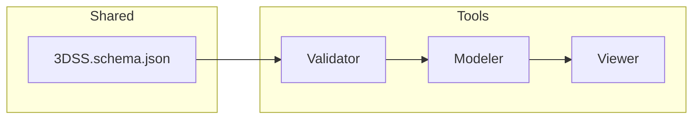

# 3DSD-Modeler

---

### P1-01 機能スコープ定義（修正版 / locked）

---

## 1. 目的
3DSD-Modeler は、**3D 構造を生成・構築するための中核モデラ**であり、
**3DSS.schema.json** に準拠した構造データを **ゼロベースから生成・編集・再構成** する。
Validator は整合を確認する補助装置として動作し、Modeler 自体は初期状態から完全な構造を構築できる。
Viewer はその出力を可視化・検証する表現層である。

---

## 2. 機能範囲（Scope）

| 区分 | 内容 |
|------|------|
| **入力** | 空の作業空間または既存の 3DSS 形式 JSON（任意）。外部入力は補助機能に留まる。 |
| **出力** | schema-valid な 3DSS 形式 JSON データ。保存時に Validator による検証を行う。 |
| **対象要素** | `points`、`lines`、`aux`、および `document_meta` の構造的生成・編集・結合・削除・意味付与。 |
| **主機能** | 構造の設計・生成・再構成。points / lines / aux の新規生成、関係設定、属性付与。 |
| **補助機能** | 既存構造の部分再利用、Undo/Redo、整列スナップ、group_uuid 管理、リアルタイム Validator 呼び出し。 |
| **UI層構造** | Lite / Edit / Expert / Dev の 4モード構成。モード切替によりUI密度を変更。 |
| **保存形式** | schema-valid JSON（`3dss.json`）。ローカル保存または GitHub push に対応。 |
| **依存関係** | three.js, ajv, ajv-formats, local-validator API。 |
| **API出力** | Modeler API 経由で Viewer に構造状態を送信可能。 |
| **バージョン整合性** | `document_meta.schema_uri` が 3DSS v1.0.0 と一致していること。 |

---

## 3. 機能詳細

### 3.1 生成・編集対象
- **points**：3D座標・marker・meta情報の追加・移動・削除。  
- **lines**：points 間の関係線生成（relation, sense, appearance, meta編集対応）。  
- **aux**：注釈・説明・参照線などの補助要素追加。  
- **document_meta**：UUID・author・version・schema_uri の自動管理。  

### 3.2 操作体系
- ゼロベース作成を前提としたモデリングフロー。  
- ダイレクトマニピュレーション（クリック・ドラッグ・ホイール）。  
- オブジェクトパネルによるプロパティ設定。  
- 複数選択・整列スナップ・階層的グループ化。  
- Undo/Redo（最大64段階）。  
- 保存時に自動 Validator 呼び出し。  

### 3.3 出力仕様
```json
{
  "points": [...],
  "lines": [...],
  "aux": [...],
  "document_meta": {
    "uuid": "auto-generated",
    "schema_uri": "https://3dsl.io/schema/3DSS.schema.json",
    "author": "modeler",
    "version": "1.0.0"
  }
}
```

---

## 4. 除外範囲（Out of Scope）
- 3Dレンダリング・アニメーション・カメラ制御（Viewer 領域）。  
- AI支援生成（Analyzer 領域）。  
- バージョン履歴管理（別モジュール）。  
- 複数ユーザーによる同時編集機能。  

---

## 5. スキーマ対応表（抜粋）

| 3DSSセクション | 編集可否 | 説明 |
|----------------|-----------|------|
| `lines.*` | ✅ | relation, sense, appearance, meta の生成・編集。 |
| `points.*` | ✅ | position, marker, meta.uuid の生成・操作。 |
| `aux.*` | ✅ | appearance のみ操作可能。signification は対象外。 |
| `document_meta.*` | ✅ | uuid, author, schema_uri 自動更新。 |
| `$defs.validator.*` | ❌ | Validator 専用領域。参照のみ。 |

---

## 6. Codex Directives 概略（予告）
Codex 実装時には以下を含む：
```text
Implement /code/modeler/
  - Language: JavaScript (ESM)
  - Libraries: three.js, ajv, ajv-formats
  - Features: points/lines/aux 構造生成, Validator 呼び出し, Undo/Redo
  - UI: Lite/Edit/Expert/Dev モード構成
  - Output: schema-valid 3DSS JSON
```


---
---


# P1-02 I/O 定義（Modeler）

## 1. 目的

Codex が誤読なく実装可能なように、Modeler の 入力／出力構造および主要APIインタフェース を厳密に定義する。

## 2. 入出力概要
種別	内容	形式	備考
入力	ユーザ操作または外部JSON読込による構造要素データ	JSオブジェクトまたはJSON文字列	外部ファイルはオプション
出力	schema-valid 3DSS JSON	JSONファイル（.3dss.json）	Validator経由で検証
補助入出力	Validator結果、Undo/Redo履歴	内部オブジェクト	保存対象外

## 3. 主API仕様
// 構造要素操作
interface ModelerAPI {
  createPoint(position: [number, number, number], marker?: MarkerOptions): Point;
  createLine(a_uuid: string, b_uuid: string, relation?: RelationOptions): Line;
  createAux(type: 'grid'|'axis'|'shell'|'hud', params?: object): Aux;
  deleteElement(uuid: string): boolean;
  updateMeta(key: keyof DocumentMeta, value: any): void;
  exportJSON(pretty?: boolean): string;
  validateCurrent(): ValidationResult;
}


MarkerOptions, RelationOptions, DocumentMeta は 3DSS.schema.json の該当セクションに準拠。

## 4. 入力構造

内部的には常に JS オブジェクト構造で保持される。

{
  points: [ { appearance: {...}, meta: { uuid: "..." } } ],
  lines:  [ { signification: {...}, appearance: {...}, meta: {...} } ],
  aux:    [ { appearance: {...}, meta: {...} } ],
  document_meta: { document_uuid: "...", schema_uri: "...", author: "...", version: "..." }
}


ゼロベース起動時は空構造を生成。

外部読込時は Validator を通して即時検証。

## 5. 出力仕様

保存時に以下の手順で出力を生成する：

ステップ	処理	説明
① Resolve	座標・拘束式・依存関係を数値化	非構造情報を確定値に変換
② Flatten	グループや参照ノードを展開	全要素を一次リスト化
③ Prune	一時・未確定要素を削除	UI・履歴・仮要素を排除
④ Normalize	3DSS規約に正規化	単位・色・列挙値整合
⑤ Validate	Schema検証	Validator呼出（AJV）
⑥ Export	JSONファイル保存	scene.3dss.json として出力

## 6. 出力例（最小）
{
  "points": [
    {
      "appearance": { "position": [0,0,0], "marker": { "shape": "sphere" } },
      "meta": { "uuid": "aaaa-bbbb-cccc-dddd-eeee" }
    }
  ],
  "lines": [],
  "aux": [],
  "document_meta": {
    "document_uuid": "1111-2222-3333-4444-5555",
    "schema_uri": "https://3dsl.io/schema/3DSS.schema.json",
    "author": "modeler",
    "version": "1.0.0"
  }
}

## 7. 制約・前提

JSONサイズ上限：10MB（大規模構造用）。

文字コード：UTF-8。

Schema準拠：3DSS.schema.json draft 2020-12。

Validator依存：ajv@^8, ajv-formats。

document_meta.schema_uri の不一致は保存不可。


---
---


# P1-04 依存関係・命名規則定義（全ライン共通）

### 1. 依存関係一覧

| 区分                  | 主要ライブラリ／モジュール               | 使用箇所                         | バージョン／備考                                     |
| ------------------- | --------------------------- | ---------------------------- | -------------------------------------------- |
| **Core Validation** | `ajv`                       | Validator / Modeler / Viewer | ^8.x（draft 2020-12対応）                        |
| **Format検証**        | `ajv-formats`               | Validator / Modeler          | color, uuid, uri, email 等                    |
| **3D描画**            | `three.js`                  | Modeler / Viewer             | r160以降（ESM import）                           |
| **操作補助**            | `OrbitControls`             | Viewer                       | three/examples/jsm/controls/OrbitControls.js |
| **UI構築**            | `dat.GUI`                   | Viewer（UIPanel制御）            | ^0.7.x                                       |
| **履歴管理**            | `UndoRedoManager`（自作）       | Modeler                      | /code/common/state/UndoRedoManager.js        |
| **エクスポート共通契約**      | `Exporter`（自作）              | Modeler                      | Resolve / Flatten / Prune / Normalize 実装     |
| **検証橋渡し**           | `ValidatorBridge`（自作）       | Modeler / Viewer             | 内部的に `import('/code/validator/index.js')`    |
| **状態保持**            | `StateManager`（自作）          | Modeler                      | points / lines / aux / meta 保持構造             |
| **UI操作層**           | `UIController`（自作）          | Modeler / Viewer             | 各UIイベント → Core API 呼出                        |
| **共通Schema参照**      | `/schemas/3DSS.schema.json` | 全ライン                         | draft 2020-12固定、v1.0.0                       |

---

### 2. 命名規則（共通）

| 分類                               | 規則                                                  | 例                                                            |
| -------------------------------- | --------------------------------------------------- | ------------------------------------------------------------ |
| **コードファイル（HTML/JS/CSS）**         | アンダースコア（`_`）禁止。camelCase または kebab-case 使用。         | `/code/modeler/mainView.js`, `/code/viewer/render-engine.js` |
| **ドキュメント／スキーマファイル（.md / .json）** | セクション識別のため `_` 許可。                                  | `/specs/3DSD_modeler.md`, `/schemas/3DSS.schema.json`        |
| **クラス名**                         | PascalCase                                          | `ModelerAPI`, `ValidatorBridge`, `ViewStateManager`          |
| **関数名**                          | camelCase                                           | `createPoint`, `validateFile`, `exportJSON`                  |
| **イベント名**                        | on＋動詞＋名詞                                            | `onSelectPoint`, `onValidateComplete`                        |
| **変数名**                          | snake_case は禁止、camelCase統一                          | `viewState`, `schemaUri`, `metaInfo`                         |
| **UUID項目**                       | 末尾を明示：`*_uuid`                                      | `document_uuid`, `group_uuid`, `meta.uuid`                   |
| **JSONキー**                       | 3DSS.schema.json に準拠、スキーマ外キーは禁止                     | `points`, `lines`, `aux`, `document_meta`                    |
| **内部ファイル拡張子**                    | `.js`（ESM） / `.json` / `.md` / `.html`              | -                                                            |
| **出力ファイル**                       | `.3dss.json`（schema-valid 構造ファイル）。アンダースコア禁止。        | `scene-001.3dss.json`                                        |
| **命名語彙統一**                       | *modeler* / *viewer* / *validator* 固定（接頭に 3DSD- 不要） | `"generator": "3DSD-Modeler/1.0.0"`                          |

---

### 3. 依存方向ルール

```text
Validator ← Modeler ← Viewer
```

* Validator：下層基盤。どこからも呼ばれるが他を呼ばない。
* Modeler：Validatorを利用するが、Viewerを呼ばない。
* Viewer：Validatorを利用するが、Modelerを呼ばない。
* 三者は `/schemas/3DSS.schema.json` を共通の基点とする。

---

### 4. バージョン連鎖ポリシー

| 要素                         | 管理項目      | 継承規則                                            |
| -------------------------- | --------- | ----------------------------------------------- |
| `document_meta.schema_uri` | スキーマ定義URI | 3DSS.schema.jsonのversionに一致                     |
| `document_meta.version`    | 文書版       | Modeler → Viewerに継承                             |
| `meta_info.validated_by`   | 検証実行バージョン | Validatorのversionを明記                            |
| `meta_info.generator`      | 生成モジュール   | `"3DSD-Modeler/x.x.x"` or `"3DSD-Viewer/x.x.x"` |

---

### 5. モジュール相互依存図（概念）



---

### 6. 命名衝突禁止リスト

| 禁止語                            | 理由                            |
| ------------------------------ | ----------------------------- |
| `specsync`, `registry`, `plan` | 仮想中間層に該当（3DSLでは禁止）            |
| `digidiorama`, `canvas`        | 旧名称／誤参照を防ぐため                  |
| `root`                         | JSONスキーマ上の非構造参照誤解を防ぐため        |
| `children`                     | 再帰構造誤導のため使用禁止（代替：`subpoints`） |

---

---

## Constraints 節（P1-05 初稿）

### 1. 初期化条件

* 起動時に `/schemas/3DSS.schema.json` をロードし、draft 2020-12 構文へ Ajv によりコンパイル済であること。
* `StateManager.initialize()` により空構造 `{points:[], lines:[], aux:[], document_meta:{…}}` を生成。
* `document_meta` の初期化時に `document_uuid`（v4 UUID）と `schema_uri`, `author`, `version` を自動発行。
* three.js のレンダラ・シーン・カメラを `UIController.init()` で準備済であること。

### 2. 制約条件

| 項目        | 内容                                                                |
| --------- | ----------------------------------------------------------------- |
| JSON構造    | `/schemas/3DSS.schema.json` に完全準拠。未定義キーは `strict` 時に拒否。           |
| ファイルサイズ   | 既定 10 MB 以内。                                                      |
| Undo/Redo | 最大 64 段階（`UndoRedoManager` 上限）。                                   |
| Point数    | 10 000 件を超える場合は警告 (MW101)。                                        |
| Line参照    | `end_a.ref` と `end_b.ref` は `points.meta.uuid` のみ参照可。自己参照・交差参照禁止。 |
| Aux構造     | `appearance` + `meta` のみを許可。`signification` は不可。                  |
| UUID形式    | すべて v4 準拠。正規表現 `^[0-9a-f]{8}-` で判定。                               |
| SchemaURI | `document_meta.schema_uri` は 3DSS v1.0.0 固定。異なる場合は保存不可 (ME001)。   |

### 3. 例外条件

* Validator が応答しない／スキーマ不一致 → `ValidatorBridgeError`。
* StateManager 内部配列破損 → `StateCorruptionError`。
* Undo/Redo 履歴オーバーフロー → `UndoOverflowWarning`。
* ファイル保存失敗 → `ExportIOError`。
* 不正 UUID 生成 → `UUIDGenerationError`。

### 4. エラーハンドリング方針

| 区分                        | 処理方針                             |
| ------------------------- | -------------------------------- |
| 構造破損（State異常・Validator失敗） | 例外スロー → UIに警告表示、保存禁止。            |
| 軽微警告（履歴上限・大量要素）           | `warnings[]` に記録し続行。             |
| 保存時検証NG                   | 出力停止し `ValidatorBridge` から詳細を受信。 |
| 内部例外                      | `console.error` に出力し状態をロールバック。   |

### 5. 安全動作・復旧規約

* 例外発生時も Modeler プロセスは継続し、直前の StateManager 状態へ自動ロールバック。
* `exportJSON()` は Validator 成功時のみファイル生成。
* すべての異常は `meta_info.last_error` として記録し、再現性を保持。
* Viewer への送信前に再検証を強制。
* UI層は例外時に赤帯メッセージを表示し、操作をブロック。


---
---


## Operation 節（P1-06b 初稿）

### 1. 実行モード概要

Modeler は設計・編集・出力を行う中核アプリケーションであり、
以下 3 モードで運用可能。`process.env.MODE` または URL パラメータで切替。

| モード          | 用途                | 実行例                                   |
| ------------ | ----------------- | ------------------------------------- |
| **Localモード** | ローカル編集／検証連携（通常運用） | `npm run modeler`                     |
| **Codexモード** | Codex 自動生成との統合実行  | Codex → `/code/modeler/` に出力          |
| **Webモード**   | ブラウザ上で軽量動作        | `localhost:5174` で起動、Service Worker対応 |

### 2. 入出力仕様

| チャネル  | 入力                               | 出力              | 備考                          |
| ----- | -------------------------------- | --------------- | --------------------------- |
| Local | JSONファイル（schema-valid）または空ドキュメント | `.3dss.json`    | `/data/`配下に保存               |
| Codex | Validator出力JSON                  | 修正版`.3dss.json` | Codex実行後にPushされる            |
| Web   | Drag&Dropファイル or FilePicker      | `.3dss.json`    | `/cache/last_edit.json` に保存 |

出力ファイル例：

```json
{
  "points": [...],
  "lines": [...],
  "aux": [...],
  "document_meta": {
    "uuid": "xxx-xxx",
    "schema_uri": "https://3dsl.io/schema/3DSS.schema.json",
    "author": "user",
    "version": "1.0.0"
  },
  "meta_info": {
    "last_event": { "type": "validated", "code": "M000", "timestamp": "2025-10-23T12:00:00Z" }
  }
}
```

### 3. 環境設定

| 変数名              | 用途             | 既定値                        |
| ---------------- | -------------- | -------------------------- |
| `MODE`           | 実行モード          | `local`                    |
| `DATA_DIR`       | 入出力ディレクトリ      | `/data/`                   |
| `VALIDATOR_PATH` | Validator 呼出し先 | `/code/validator/index.js` |
| `VIEWER_PATH`    | Viewer 呼出し先    | `/code/viewer/index.js`    |
| `LOG_DIR`        | 実行ログ           | `/logs/runtime/`           |
| `CACHE_DIR`      | セッションキャッシュ     | `/cache/`                  |
| `MAX_UNDO`       | Undo 履歴数       | 64                         |

### 4. 運用フロー

```mermaid
flowchart TD
  A1[起動: modeler.js] --> B1[StateManager.initialize()]
  B1 --> B2[UIController.init()]
  B2 --> C1[ユーザ操作]
  C1 -->|編集| D1[StateManager更新]
  C1 -->|保存| D2[exportJSON()]
  D2 --> D3[ValidatorBridge.validate()]
  D3 -->|OK| D4[保存完了 → /data/]
  D3 -->|NG| D5[警告表示・再編集]
  C1 -->|Viewer送信| D6[ViewerBridge.postMessage()]
```

### 5. ファイル出力・ログ

| 種別   | 出力先                                    | 説明                    |
| ---- | -------------------------------------- | --------------------- |
| 正常保存 | `/data/<uuid>.3dss.json`               | schema-valid JSON。    |
| 一時保存 | `/cache/last_edit.json`                | 自動保存。                 |
| 検証ログ | `/logs/runtime/modeler_validation.log` | ValidatorBridge結果を記録。 |
| 操作ログ | `/logs/runtime/modeler_ui.log`         | UIイベントを逐次記録。          |

ログフォーマット：

```
[YYYY-MM-DD HH:MM:SS] [Modeler] EVENT:createPoint ID:abc123 STATUS:OK
```

### 6. Codex／GitHub 運用統合

* Codex は Modeler を `/code/modeler/` に生成し、`specs/` の I/O 構造を参照する。
* Codex 出力ファイルは `task/*` ブランチ上で自動テストされ、Validator による検証が CI で実行。
* GitHub Actions 設定例：

```bash
node /code/modeler/modeler.js --mode codex --export ./data/
```

* 検証通過後、Viewer が自動起動しプレビュー生成を行う。

### 7. 異常復旧・再試行設計

* 保存失敗時は `/cache/` のバックアップを自動リストア。
* ValidatorBridge が応答しない場合、リトライ最大3回。
* Undo/Redo エラー時は State をフリーズして再初期化を促す。
* 例外発生時は `meta_info.last_event` に `{type:"error", code:"Mxxx"}` を記録。


---
---


## Codex Directives 節（P1-06 正規初稿）

以下は Codex に対して発行する Modeler 生成命令文 である。
出力対象は /code/modeler/ 配下、参照仕様は /schemas/3DSS.schema.json および本ファイル内「I/O定義」「Constraints」「Operation」節。

### Directive 01 — コアモジュール構成

目的: Modeler の中核構造を自動生成する。
出力場所: /code/modeler/

生成するモジュール:
  - index.js           → 起動エントリーポイント（mode判定含む）
  - modelerCore.js     → StateManager／UIController初期化
  - stateManager.js    → points / lines / aux / meta の保持とUndoRedo制御
  - uiController.js    → DOM操作とイベント中継
  - validatorBridge.js → Validator呼出ラッパ
  - viewerBridge.js    → Viewer連携ラッパ
  - exporter.js        → JSON出力 (Resolve / Flatten / Normalize)
  - logger.js          → 共通ログ出力


すべて ES Module 構文を用いる。index.js は環境変数 MODE を参照して Local／Codex／Web モードを切替。

### Directive 02 — State 管理実装

目的: points・lines・aux の編集状態と Undo/Redo を管理。

StateManager:
  - init(emptyDocument)
  - createPoint(data)
  - createLine(data)
  - deleteElement(uuid)
  - undo(), redo()
  - exportState()


内部で meta_info.last_event を更新し、保存時に ValidatorBridge へ送信。
Undo履歴は最大64件、MAX_UNDO 環境変数で変更可能。

### Directive 03 — 検証ブリッジ

目的: 編集中データを Validator に送信し結果を取得。

ValidatorBridge.validate(data):
  1. import('/code/validator/index.js')
  2. validateJSON(data)
  3. 結果をUIに表示（警告は黄色・エラーは赤）
  4. 戻り値を Promise で返す


失敗時は3回まで自動リトライし、meta_info.last_event に記録。

### Directive 04 — 出力・保存処理

目的: schema-valid な JSON を /data/ に保存。

Exporter.exportJSON(state):
  - 正常時: /data/<uuid>.3dss.json に書込
  - 検証失敗時: /cache/last_edit.json に保存し警告
  - 書式: JSON.stringify(data, null, 2)


CLI モードでは --export 引数により出力先を指定可。

### Directive 05 — Viewer 連携

目的: 保存直後のデータを Viewer に送信してプレビュー。

ViewerBridge.postMessage(data):
  - window.postMessage(JSON.stringify(data))
  - Viewer側でloadJSON()をトリガー
  - 成功時: console.info('Preview updated')


Webモード時のみ自動起動。Codex実装では viewerBridge.js 内で非同期通信を行う。

### Directive 06 — UI 実装仕様

目的: 最低限の操作UIを構築。

index.html:
  - Add Point / Add Line / Validate / Save / Preview ボタン
uiController.js:
  - 各ボタンのイベントを stateManager に中継
  - 結果を画面下部にログ表示
style.css:
  - Flexレイアウト、配色: dark theme


DOM構造は単純でよく、CodexはイベントハンドラとState更新が動作することを優先。

### Directive 07 — ロギングと例外処理

目的: すべての操作をログ化し、例外を捕捉して復旧。

logger.log(level, message, context)
  - level: INFO/WARN/ERROR
  - 出力先: /logs/runtime/modeler_ui.log


エラー発生時は自動でキャッシュ保存し、meta_info.last_event に {type:"error", code:"Mxxx"} を記録。

### Directive 08 — テスト・検証

目的: Codex 生成後の自己検証。

テスト仕様:
  - 新規点/線作成 → 保存 → Validator OK → Viewer起動
  - Undo/Redo → State一貫性保持
  - 出力JSONを 3DSS.schema.json で再検証


---
---

---
# locked: true
# locked_date: 2025-10-24
# phase: P1-08 (承認済)
# modification_rule: 改訂はP4で `.rev1.md` として作成すること
---