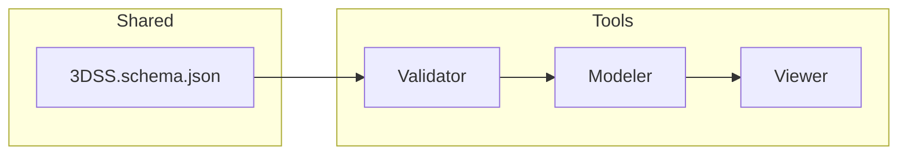

# 3DSD-Validator

---

### P1-01 機能スコープ定義（初稿）

---

## 1. 目的
3DSD-Validator は、**3DSS.schema.json** に基づき
構造データ（lines / points / aux / document_meta）を検証する最下層の中核ツールである。
すべての上位アプリケーション（Modeler / Viewer）は Validator の整合判定を前提に動作する。

---

## 2. 機能範囲（Scope）

| 区分 | 内容 |
|------|------|
| **入力** | 3DSS 形式の JSON ファイル。ローカルパスまたはUIからの直接入力。 |
| **出力** | 検証レポート（OK / NG / 警告 / 推奨修正）、および JSON 形式の結果ログ。 |
| **検証対象** | `/schemas/3DSS.schema.json` に準拠する全要素（lines / points / aux / document_meta）。 |
| **検証方式** | Ajv による schema validation（draft2020-12）＋内部ルール検査。 |
| **UI 機能** | 単体ファイル検証・結果表示・再ロード・再検証ボタン・結果エクスポート。 |
| **呼び出し形態** | 単体動作（CLI / Web UI）＋Modeler/Viewer からのAPI呼出対応。 |
| **出力構造** | `status`, `errors[]`, `warnings[]`, `meta_info`, `schema_version`。 |
| **バージョン整合性** | `document_meta.schema_uri` が 3DSS v1.0.0 と一致することを必須条件とする。 |

---

## 3. 機能詳細

### 3.1 基本検証
- スキーマ整合（type, enum, requiredSets）
- `$defs/validator/type_check` に定義されたフォーマット（uuid, color, uri 等）チェック  
- 参照整合（`end_a.ref` ⇆ `points.meta.uuid`）

### 3.2 拡張検証
- ref_integrity：自己参照・交差参照禁止  
- tag pattern（`s|m|x:`接頭辞）形式統一  
- `document_meta` の必須項目確認（uuid, schema_uri, author, version）  
- 不要要素・未定義プロパティ検出

### 3.3 出力構造
```json
{
  "status": "OK | NG",
  "errors": [{ "path": "points[0].meta.uuid", "message": "invalid uuid" }],
  "warnings": [{ "path": "lines[1].signification", "message": "missing sense" }],
  "meta_info": { "schema_version": "1.0.0", "validated_at": "2025-10-23T00:00:00Z" }
}
```

---

## 4. 除外範囲（Out of Scope）
- 外部schema（拡張モジュール / extension）検証  
- ファイルI/Oの多重検証（大量ファイルのバッチ処理）  
- GUIレンダリングや視覚出力（Viewer領域）  
- 意味推論・自動修正（Analyzer領域）

---

## 5. スキーマ対応表（抜粋）

| 3DSSセクション | 検証責任 | チェック内容 |
|----------------|------------|---------------|
| `lines.*` | Validator core | relation / sense / appearance構成の整合 |
| `points.*` | Validator core | position / marker / meta.uuidの形式 |
| `aux.*` | Validator core | appearance内要素のみ、signification無し |
| `document_meta.*` | Validator core | uuid / schema_uri / author / version の存在と型一致 |
| `$defs.validator.*` | Validator self-test | type_check / pattern / enum_constraint の整合 |

---

## 6. Codex Directives 概略（予告）
Codex実装時には以下を含む：
```text
Implement /code/validator/
  - Import: ajv, ajv-formats
  - Input: JSON file / text input
  - Output: validationResult object
  - Optional UI: simple HTML + JS viewer
```


---
---


# P1-02 I/O 定義（Validator）
## 1. 目的

Codexが誤読なく実装できるよう、Validator の 入力形式／出力形式／呼び出しインタフェース を厳密化する。

## 2. インタフェース概要
項目	定義
入力チャネル	(A) JSオブジェクト, (B) JSON文字列, (C) ファイルパス/Blob（*.json）
スキーマ基準	/schemas/3DSS.schema.json（draft 2020-12）
バージョン検査	document_meta.schema_uri が .../3DSS.schema.json を含み、document_meta.version が互換範囲内であること
出力	ValidationResult オブジェクト（JSONシリアライズ可能）
運用モード	ライブラリ（ESM）／CLI／Web UI（ブラウザ）

## 3. 入力形式

A: JSオブジェクト
validate(data: object, options?: ValidateOptions): Promise<ValidationResult>

B: JSON文字列
validateJSON(jsonText: string, options?: ValidateOptions): Promise<ValidationResult>

C: ファイル
Node: validateFile(path: string, options?: ValidateOptions): Promise<ValidationResult>
Browser: validateBlob(file: File|Blob, options?: ValidateOptions): Promise<ValidationResult>

ValidateOptions（省略可）:

interface ValidateOptions {
  warnAsError?: boolean;     // 既定: false
  strict?: boolean;          // 既定: true（追加プロパティ禁止）
  maxBytes?: number;         // 既定: 5_000_000（5MB）
  schemaUri?: string;        // 既定: /schemas/3DSS.schema.json
}

## 4. 出力形式（ValidationResult）
interface ValidationResult {
  status: 'OK' | 'NG';
  errors: Array<{ path: string; code: string; message: string }>;
  warnings: Array<{ path: string; code: string; message: string }>;
  meta_info: {
    schema_version: string;          // 例: "1.0.0"
    validated_at: string;            // ISO8601（UTC）
    document_uuid?: string;          // document_meta.uuid（存在時）
  };
}

status は errors.length === 0 かつ strict 条件を満たすとき OK。

warnAsError=true の場合、warnings が存在すれば status='NG'。

## 5. エラー／警告コード（抜粋）
コード	種別	説明
V001	Error	document_meta.schema_uri 不一致
V002	Error	互換外の document_meta.version
V101	Error	points[*].meta.uuid の形式不正
V102	Error	lines[*].end_a.ref が存在しない point を参照
V201	Warn	未使用の aux 要素
V202	Warn	appearance.color が規定外表現（#RRGGBB以外）
V301	Error	未定義プロパティの検出（strict時）

コード体系は将来拡張可能。VxYY（x=カテゴリ, YY=連番）。

## 6. CLI 仕様（Node.js）
3dss-validate --in ./scene.3dss.json \
              --out ./report.json \
              --schema ./schemas/3DSS.schema.json \
              --strict \
              --warn-as-error \
              --format json|text

退出コード: 0=OK, 1=NG（検証失敗）, 2=実行時エラー。

--format text の場合、コンソール向けの要約を出力。

## 7. ライブラリAPI（ESM）
import { validate, validateJSON, validateFile, validateBlob } from '/code/validator/index.js';

const result = await validate(data, { strict: true });
if (result.status === 'NG') {
  // エラー処理
}

## 8. Web UI API（ブラウザ）
ドラッグ&ドロップ／ファイル選択で JSON を投入。
window.Validator.validateBlob(file) を呼び出し、結果を画面に表示。
画面操作: 「再検証」「結果を保存（JSON）」ボタン。

## 9. 制約・前提
JSONサイズ上限：既定 5MB（maxBytes で変更可）。
文字コード：UTF-8 / 正規化 NFC 推奨。
スキーマドラフト：2020-12 固定。
依存: ajv@^8, ajv-formats。

## 10. サンプル（最小）
{
  "points": [{"position":[0,0,0],"marker":"dot","meta":{"uuid":"550e8400-e29b-41d4-a716-446655440000"}}],
  "lines": [],
  "aux": [],
  "document_meta": {
    "uuid": "4c2a…",
    "schema_uri": "https://3dsl.io/schema/3DSS.schema.json",
    "author": "tester",
    "version": "1.0.0"
  }
}


---
---


# P1-04 依存関係・命名規則定義（全ライン共通）

## 1. 依存関係一覧

| 区分                  | 主要ライブラリ／モジュール               | 使用箇所                         | バージョン／備考                                     |
| ------------------- | --------------------------- | ---------------------------- | -------------------------------------------- |
| **Core Validation** | `ajv`                       | Validator / Modeler / Viewer | ^8.x（draft 2020-12対応）                        |
| **Format検証**        | `ajv-formats`               | Validator / Modeler          | color, uuid, uri, email 等                    |
| **3D描画**            | `three.js`                  | Modeler / Viewer             | r160以降（ESM import）                           |
| **操作補助**            | `OrbitControls`             | Viewer                       | three/examples/jsm/controls/OrbitControls.js |
| **UI構築**            | `dat.GUI`                   | Viewer（UIPanel制御）            | ^0.7.x                                       |
| **履歴管理**            | `UndoRedoManager`（自作）       | Modeler                      | /code/common/state/UndoRedoManager.js        |
| **エクスポート共通契約**      | `Exporter`（自作）              | Modeler                      | Resolve / Flatten / Prune / Normalize 実装     |
| **検証橋渡し**           | `ValidatorBridge`（自作）       | Modeler / Viewer             | 内部的に `import('/code/validator/index.js')`    |
| **状態保持**            | `StateManager`（自作）          | Modeler                      | points / lines / aux / meta 保持構造             |
| **UI操作層**           | `UIController`（自作）          | Modeler / Viewer             | 各UIイベント → Core API 呼出                        |
| **共通Schema参照**      | `/schemas/3DSS.schema.json` | 全ライン                         | draft 2020-12固定、v1.0.0                       |

---

## 2. 命名規則（共通）

| 分類                               | 規則                                                  | 例                                                            |
| -------------------------------- | --------------------------------------------------- | ------------------------------------------------------------ |
| **コードファイル（HTML/JS/CSS）**         | アンダースコア（`_`）禁止。camelCase または kebab-case 使用。         | `/code/modeler/mainView.js`, `/code/viewer/render-engine.js` |
| **ドキュメント／スキーマファイル（.md / .json）** | セクション識別のため `_` 許可。                                  | `/specs/3DSD_modeler.md`, `/schemas/3DSS.schema.json`        |
| **クラス名**                         | PascalCase                                          | `ModelerAPI`, `ValidatorBridge`, `ViewStateManager`          |
| **関数名**                          | camelCase                                           | `createPoint`, `validateFile`, `exportJSON`                  |
| **イベント名**                        | on＋動詞＋名詞                                            | `onSelectPoint`, `onValidateComplete`                        |
| **変数名**                          | snake_case は禁止、camelCase統一                          | `viewState`, `schemaUri`, `metaInfo`                         |
| **UUID項目**                       | 末尾を明示：`*_uuid`                                      | `document_uuid`, `group_uuid`, `meta.uuid`                   |
| **JSONキー**                       | 3DSS.schema.json に準拠、スキーマ外キーは禁止                     | `points`, `lines`, `aux`, `document_meta`                    |
| **内部ファイル拡張子**                    | `.js`（ESM） / `.json` / `.md` / `.html`              | -                                                            |
| **出力ファイル**                       | `.3dss.json`（schema-valid 構造ファイル）。アンダースコア禁止。        | `scene-001.3dss.json`                                        |
| **命名語彙統一**                       | *modeler* / *viewer* / *validator* 固定（接頭に 3DSD- 不要） | `"generator": "3DSD-Modeler/1.0.0"`                          |

---

## 3. 依存方向ルール

```text
Validator ← Modeler ← Viewer
```

* Validator：下層基盤。どこからも呼ばれるが他を呼ばない。
* Modeler：Validatorを利用するが、Viewerを呼ばない。
* Viewer：Validatorを利用するが、Modelerを呼ばない。
* 三者は `/schemas/3DSS.schema.json` を共通の基点とする。

---

## 4. バージョン連鎖ポリシー

| 要素                         | 管理項目      | 継承規則                                            |
| -------------------------- | --------- | ----------------------------------------------- |
| `document_meta.schema_uri` | スキーマ定義URI | 3DSS.schema.jsonのversionに一致                     |
| `document_meta.version`    | 文書版       | Modeler → Viewerに継承                             |
| `meta_info.validated_by`   | 検証実行バージョン | Validatorのversionを明記                            |
| `meta_info.generator`      | 生成モジュール   | `"3DSD-Modeler/x.x.x"` or `"3DSD-Viewer/x.x.x"` |

---

## 5. モジュール相互依存図（概念）



---

## 6. 命名衝突禁止リスト

| 禁止語                            | 理由                            |
| ------------------------------ | ----------------------------- |
| `specsync`, `registry`, `plan` | 仮想中間層に該当（3DSLでは禁止）            |
| `digidiorama`, `canvas`        | 旧名称／誤参照を防ぐため                  |
| `root`                         | JSONスキーマ上の非構造参照誤解を防ぐため        |
| `children`                     | 再帰構造誤導のため使用禁止（代替：`subpoints`） |


---
---


## Constraints 節（P1-05 修正版）

### 1. 初期化条件

* Ajv および ajv-formats をロード済であること。draft2020-12 schema に準拠。
* `/schemas/3DSS.schema.json` が存在し、参照可能であること。
* 入力は UTF-8 / JSON形式であること（BOM禁止）。
* 環境依存値（ロケール・時刻・OSパス区切りなど）を検証ロジックに含めない。

### 2. 制約条件

| 項目      | 内容                                                                            |
| ------- | ----------------------------------------------------------------------------- |
| JSONサイズ | 既定で10MB以下。`ValidateOptions.maxBytes` により上限変更可。                                |
| スキーマ固定  | `/schemas/3DSS.schema.json` のみを対象。draft変更は別バージョンとして扱う。                        |
| 検証深度    | 最大10階層までネストを許容。それ以上は警告（V299）。                                                 |
| URI形式   | `schema_uri` に [https://3dsl.io/schema/…](https://3dsl.io/schema/…) 形式を必須とする。 |
| UUID形式  | v4準拠。正規表現 `/^[0-9a-f]{8}-/` を通過しない場合はエラー(V101)。                               |
| 未定義キー   | `strict=true` の場合、追加プロパティ検出時にエラー(V301)。                                       |

### 3. 例外条件

* スキーマファイルが存在しない場合 → `SchemaNotFoundError`。
* JSONパース不可の場合 → `InvalidJSONError`。
* 入力が `null` または空オブジェクトの場合 → `EmptyInputError`。
* `document_meta.schema_uri` 不一致 → `SchemaVersionMismatchError`。
* 内部関数の呼出しに失敗した場合 → `InternalValidationError`。

### 4. エラーハンドリング方針

| 区分                    | 処理方針                                       |
| --------------------- | ------------------------------------------ |
| 致命的（Schema不一致・JSON破損） | 例外スロー → プログラム停止。CLI: 終了コード1。               |
| 構文違反・型不整合             | `errors[]` に格納。`status='NG'`。              |
| 軽微な警告（未使用要素・非推奨色等）    | `warnings[]` に格納。`warnAsError=false` 時は継続。 |
| 内部例外（Validator内部エラー）  | 例外ログ出力後、`status='NG'` で結果を返す。              |
| 呼出元がUIの場合             | 例外を投げずにメッセージパネルへ表示。                        |

### 5. 安全動作・復旧規約

* すべての例外は `try/catch` で捕捉し、`ValidationResult` 構造にまとめて返却。
* エラーがあっても Validator 自身がクラッシュしないこと。
* ログは `console.error` に出力し、UI呼出時は画面上に警告アイコンを表示。
* 例外発生時は `meta_info.last_event` に `{ type, code, timestamp }` を記録し、`status='NG'` を保証。
* CLIモードでは `--format text` 時にエラーメッセージを要約表示。


---
---


## Operation 節（P1-06a 初稿）

### 1. 実行モード概要

Validator は単一コードベースであり、次の 3 モードで動作可能。
起動時に `process.env.MODE` または CLI 引数 `--mode` により切替える。

| モード            | 用途                            | 実行例                                                            |
| -------------- | ----------------------------- | -------------------------------------------------------------- |
| **CLIモード**     | 手動検証・GitHub Actions 等の自動検証    | `node validator.js --input ./data/sample.3dss.json --mode cli` |
| **Libraryモード** | Modeler／Viewer など他モジュールから呼び出す | `import { validateJSON } from '/code/validator/index.js'`      |
| **WebUIモード**   | ブラウザ上でドラッグ＆ドロップ検証             | `npm run serve` → `localhost:5173`                             |

### 2. 入出力仕様

| 入力チャネル  | 型                      | 備考                                 |
| ------- | ---------------------- | ---------------------------------- |
| CLI     | ファイルパスまたは標準入力          | JSONのみ。UTF-8、BOM禁止。                |
| Library | JavaScriptオブジェクトまたは文字列 | `validateJSON(data, opts)`         |
| WebUI   | Blob／File オブジェクト       | `validateBlob(file)` 非同期Promise返却。 |

出力はすべて共通構造の `ValidationResult`：

```ts
{
  status: "OK" | "NG",
  errors: [],
  warnings: [],
  meta_info: {
    schema_uri: "https://3dsl.io/schema/3DSS.schema.json",
    validated_by: "3DSD-Validator/1.0.0",
    last_event: { type, code, timestamp }
  }
}
```

### 3. 環境設定

| 項目        | 変数名           | 既定値                         | 説明                        |
| --------- | ------------- | --------------------------- | ------------------------- |
| 実行モード     | `MODE`        | `cli`                       | `cli` / `library` / `web` |
| スキーマパス    | `SCHEMA_PATH` | `/schemas/3DSS.schema.json` | draft2020-12              |
| データディレクトリ | `DATA_DIR`    | `/data/`                    | 入出力ファイルの格納先               |
| ログ出力先     | `LOG_DIR`     | `/logs/runtime/`            | 実行ログをファイル出力               |
| 最大サイズ     | `MAX_BYTES`   | `10_000_000`                | 10MB上限（P1-05統一値）          |

### 4. 運用フロー

```mermaid
flowchart TD
  A1[起動: validator.js] --> B1[MODE判定]
  B1 -->|CLI| C1[parseCLIArgs()]
  B1 -->|Library| C2[validateJSON()]
  B1 -->|WebUI| C3[listenDropEvent()]
  C1 & C2 & C3 --> D1[AjvCompile(schema)]
  D1 --> D2[AjvValidate(data)]
  D2 --> D3[InternalRulesCheck()]
  D3 --> D4[Assemble ValidationResult]
  D4 --> E1[出力: JSON/Text/UI表示]
```

### 5. 出力先とログ

| モード     | 出力先                                   | ログ保存                              |
| ------- | ------------------------------------- | --------------------------------- |
| CLI     | 標準出力 + `/data/<uuid>.validation.json` | `/logs/runtime/validator_cli.log` |
| Library | 呼出元へ return                           | 呼出側で統合ログ出力                        |
| WebUI   | DOM表示 + `/cache/validation_last.json` | `/logs/runtime/validator_ui.log`  |

ログ形式（共通ヘッダ）：

```
[YYYY-MM-DD HH:MM:SS] [Validator] STATUS:OK ERRORS:0 WARNINGS:2 FILE:sample.3dss.json
```

### 6. Codex / GitHub 運用統合

* Codex は `/schemas/`・`/specs/` のみ読み取り、Validator コードは `/code/validator/` に出力される。
* GitHub Actions CI では次コマンドを使用：

```bash
node /code/validator/validator.js --input ./data/**/*.3dss.json --mode cli
```

* 検証結果 JSON は GitHub Artifacts にアップロードし、
  Modeler／Viewer デバッグログと同期される。

### 7. 異常復旧・再試行設計

* すべての例外はキャッチ後 `ValidationResult.status='NG'` で返却。
* WebUI は 3 回まで自動再試行。
* CLI は終了コード1で停止。
* Library 呼出は Promise.reject で上位へ伝搬。
* 例外は `meta_info.last_event` に記録（type=`error`）。


---
---


## Codex Directives 節（P1-06 正規初稿）

以下は Codex に対して発行する生成命令文である。
出力対象は `/code/validator/` 配下、参照仕様は `/schemas/3DSS.schema.json` および本ファイル内「I/O定義」「Constraints」「Operation」節。

---

### Directive 01 — コアモジュール構成

**目的**: Validator の最小構成を自動生成する。
**出力場所**: `/code/validator/`

```
生成するモジュール:
  - index.js        → CLI／Libraryエントリーポイント
  - validatorCore.js → Ajv初期化と検証関数定義
  - formatExtensions.js → ajv-formats定義
  - internalRules.js → スキーマ外ルール群
  - logger.js       → 共通ログ出力
  - ui.js (任意)    → WebUIモード用、FileDropと結果表示
```

各モジュールは ES Module 構文 (`import/export`) を使用し、
`index.js` は mode 判定を行い、CLI時は `process.argv` を解析して `validatorCore.validateFile()` を呼び出す。

---

### Directive 02 — 検証ロジック実装

**目的**: JSON Schema + 内部ルールを統合し、 ValidationResult 構造を返す。

```
validateJSON(data, options):
  1. Ajvインスタンス生成（2020-12準拠、strict=true）
  2. ajv-formatsを適用（uuid, color, uri, email）
  3. 3DSS.schema.json を load
  4. 検証結果を取得 → errors[], warnings[]
  5. internalRules.check(data) を実行
  6. meta_info.last_event に {type, code, timestamp} を付与
  7. return {status, errors, warnings, meta_info}
```

内部ルールは `internalRules.js` に分離し、
例えば階層深度・未定義キー・サイズ制限など P1-05「Constraints」節の仕様に従う。

---

### Directive 03 — CLI 実行構造

**目的**: Node.js上でファイル入力を受け取り、結果を標準出力またはファイルに出力する。

```
CLI動作仕様:
  - 引数: --input, --output, --format(json|text)
  - 入力: UTF-8 JSON（BOM禁止）
  - 出力: ./data/<uuid>.validation.json
  - 終了コード: 0=OK, 1=NG, 2=例外
```

CLI実行後、`console.log`で簡潔な結果を出力し、
`/logs/runtime/validator_cli.log` に詳細を追記する。

---

### Directive 04 — WebUI動作仕様

**目的**: drag & drop による単一ファイル検証を行う軽量WebUIを生成。

```
UI構成:
  - index.html   → drop zone と result 表示エリア
  - ui.js        → FileReader + validateBlob()
  - style.css    → 結果色分け (OK=green, NG=red)
```

ブラウザ上で validatorCore を動的 import し、
`validateBlob(file)` → Promise → DOM 表示。
結果は `/cache/validation_last.json` に保存。

---

### Directive 05 — ロギングと例外処理

**目的**: 例外・警告・成功を統一フォーマットで記録。

```
logger.log(level, message, context):
  - level: 'INFO' | 'WARN' | 'ERROR'
  - message: 文字列
  - context: { file, code, timestamp }
出力:
  - CLI: console + file (/logs/runtime/validator_cli.log)
  - WebUI: console + alert表示
  - Library: consoleのみ
```

例外はすべてキャッチし、`meta_info.last_event` に反映。
Validatorは決してクラッシュしない設計。

---

### Directive 06 — テストと検証

**目的**: Codex生成後の自己検証ルーチン。

```
テスト仕様:
  - ./data/sample_valid.3dss.json を検証 → OK
  - ./data/sample_invalid.3dss.json → NG
  - 戻り値構造を JSON Schema で検証
```

---

### Directive 07 — 出力確認

**目的**: Codex出力完了後の検証。

Codexは以下の条件を満たすこと：

1. 全モジュールはESM構文でexport済み。
2. CLI, Library, WebUI の3モード動作が全て存在。
3. Ajvとajv-formatsが正しく動作。
4. `ValidationResult` が仕様に完全一致。

---

---
# locked: true
# locked_date: 2025-10-24
# phase: P1-08 (承認済)
# modification_rule: 改訂はP4で `.rev1.md` として作成すること
---